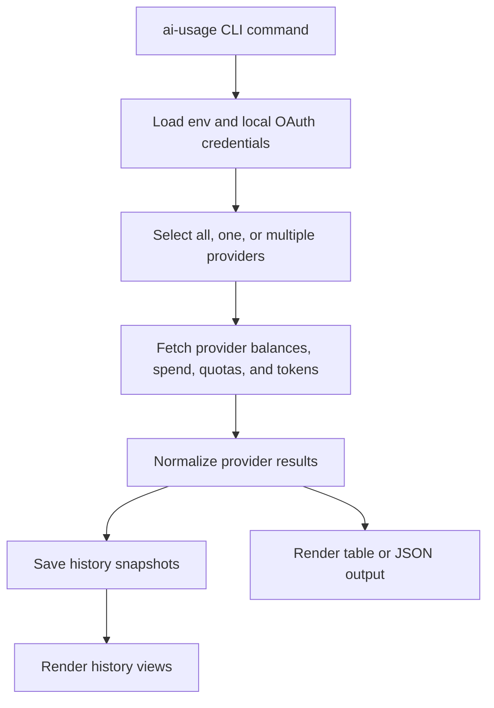

# ai-usage

Cross-provider balance, spend, subscription quota, and token usage — one command.

## Status

| Field | Value |
|---|---|
| Runtime | Python CLI, `ai_usage.cli:main` |
| Package root | `src/ai_usage/` |
| High-level front door | [`ai-usage-high-level-doc.html`](ai-usage-high-level-doc.html) |
| Documentation map | [`docs/README.md`](docs/README.md) · [`docs/README.html`](docs/README.html) |
| Canonical architecture docs | C4 model: [`docs/architecture/workspace.dsl`](docs/architecture/workspace.dsl); source-level docs: [`docs/architecture.md`](docs/architecture.md), [`docs/data-architecture.md`](docs/data-architecture.md) |
| Generated HTML companions | [`README.html`](README.html), `docs/*.html`, plus legacy root renders [`architecture.html`](architecture.html), [`data-architecture.html`](data-architecture.html) |

### Architecture map



## Example output

```text
$ ./ai-usage
 Provider       Balance         Spend       Tokens In (Hit)  Tokens In (Miss)  Tokens Out  Tokens Total
─────────────────────────────────────────────────────────────────────────────────────────────────────
   DeepSeek         $6.03          $3.97          118,428,800          7,388,843      379,566    126,197,209
        xAI        $25.00          $0.60              315,968            435,709        2,454        754,131
 OpenRouter        $55.20          $0.72                    —                  —            —              —
    Vast.ai         $4.01         $20.99                    —                  —            —              —
     Exa             —           $0.12                    —                  —            —              —
    X API          $24.99          $0.04                    —                  —            —              —
    Nous         $39.84         $25.66                    —                  —            —              —

Subscription Quotas
Subscription      Tier       Resource                 Remaining  Resets In
────────────────  ─────────  ───────────────────────  ─────────  ─────────
Claude Code       Pro        Session                       100%         5h
Claude Code       Pro        Weekly                         82%      4d12h
Codex (primary)   Plus       Session                        95%        45m
Codex (primary)   Plus       Weekly                         72%       2d2h
Codex (partner)   Pro        Session                        88%      1h10m
Codex (partner)   Pro        Weekly                         61%      4d12h
Google AI Studio  Free       Claude Opus 4.6 (Think)       100%      4h59m
Google AI Studio  Free       Gemini 3.1 Pro (High)         100%      4h59m
Google AI Studio  Free       Gemini 3.5 Flash (High)       100%      4h59m
```

## Usage

```bash
./ai-usage                          # all providers
./ai-usage help                     # same as --help
./ai-usage -p xai                   # single provider
./ai-usage -p deepseek,xai,openrouter,codex  # multiple providers
./ai-usage -m                       # per-model token breakdown
./ai-usage -m -p deepseek,xai       # per-model, filtered
./ai-usage -j                       # JSON output
./ai-usage -j -m                    # JSON with per-model breakdown
./ai-usage --history                 # last 10 fetch groups (all providers)
./ai-usage --history --history-provider xai  # last 10 rows for xAI only
./ai-usage --history --history-limit 30  # last 30 fetch groups
./ai-usage --refresh-auth nous       # refresh cached Nous OAuth token
```

### JSON output

```json
$ ./ai-usage -j -p deepseek
{
  "api": {
    "deepseek": {
      "balance": 6.03,
      "period_spend": 3.97,
      "tokens_in_hit": 118428800,
      "tokens_in_hit_percentage": 94.1,
      "tokens_in_miss": 7388843,
      "tokens_in_miss_percentage": 5.9,
      "tokens_out": 379566,
      "tokens_total": 126197209
    }
  }
}
```

With `-m`, providers that expose per-model or per-event data get a `models` key:

```json
$ ./ai-usage -j -m -p deepseek
{
  "api": {
    "deepseek": {
      "balance": 6.03,
      "period_spend": 3.97,
      "tokens_in_hit": 118428800,
      ...
      "models": {
        "deepseek-v4-pro": {
          "tokens_in_hit": 118428800,
          "tokens_in_hit_percentage": 94.1,
          "tokens_in_miss": 7388843,
          "tokens_in_miss_percentage": 5.9,
          "tokens_out": 379566,
          "tokens_total": 126197209
        },
        "deepseek-v4-flash": { ... }
      }
    }
  }
}
```

Codex JSON is under the `subscription` branch. When Hermes has multiple `openai-codex` credential-pool entries, each account is keyed by its Hermes label:

```json
$ ./ai-usage -j -p codex
{
  "subscription": {
    "codex": {
      "accounts": {
        "primary": {
          "label": "primary",
          "plan_type": "plus",
          "session": {
            "used_pct": 45,
            "remaining_pct": 55,
            "duration_mins": 300,
            "resets_at": 1778467926
          },
          "weekly": {
            "used_pct": 7,
            "remaining_pct": 93,
            "duration_mins": 10080,
            "resets_at": 1779054726
          }
        },
        "partner": {
          "label": "partner",
          "plan_type": "pro",
          "session": { "remaining_pct": 88 },
          "weekly": { "remaining_pct": 61 }
        }
      }
    }
  }
}
```

If no Hermes Codex pool exists, `ai-usage` falls back to the legacy local Codex CLI app-server path. If that local OAuth is stale, it runs interactive `codex login` once from a TTY, then retries the app-server request. In non-interactive shells, or if login still fails, Codex stays visible in the subscription table as `Rate Limits — auth failed`.

Nous uses subscription credits first, then non-expiring top-up credits. The main `balance` is total usable credits; JSON keeps the buckets explicit:

```json
$ ./ai-usage -j -p nous
{
  "api": {
    "nous": {
      "balance": 39.84,
      "period_spend": 25.66,
      "plan_type": "Plus",
      "monthly_charge": 20.00,
      "monthly_credits": 22.00,
      "credits_remaining": 39.84,
      "total_usable_credits": 39.84,
      "subscription_credits_remaining": 0.00,
      "top_up_credits_remaining": 39.84,
      "purchased_credits_remaining": 39.84,
      "rollover_credits": 3.66,
      "current_period_end": "2026-07-11T15:17:45.000Z"
    }
  }
}
```

Google AI Studio / Antigravity JSON keeps entitlement and quota sources separate:

```json
$ ./ai-usage -j -p google
{
  "subscription": {
    "google ai studio": {
      "plan_type": "free",
      "plan_label": "Antigravity Starter Quota",
      "plan_source": "loadCodeAssist.paidTier",
      "subscription_status": "free",
      "raw_tier_id": "free-tier",
      "quota_source": "fetchAvailableModels",
      "models": {
        "gemini-3.1-pro-high": {
          "display_name": "Gemini 3.1 Pro (High)",
          "remaining_pct": 100,
          "resets_at": 1782592247
        }
      }
    }
  }
}
```

## Providers

| Provider | Balance | Period Spend | Tokens Hit | Tokens Miss | Tokens Out | Per-model |
|----------|---------|-------------|------------|-------------|------------|-----------|
| DeepSeek | ✅ API | ✅ calc from tokens | ✅ platform API | ✅ platform API | ✅ platform API | ✅ |
| xAI | ✅ mgmt API | ✅ invoice API | ✅ invoice API | ✅ invoice API | ✅ invoice API | ✅ |
| OpenRouter | ✅ credits API | ✅ key monthly usage | — | — | — | — |
| Vast.ai | ✅ API | ✅ charges API | — | — | — | — |
| Exa | ✅ dashboard session | ✅ admin API | — | — | — | — |
| X API | ✅ console API | ✅ usage × pricing | — | — | — | — |
| Codex | — | — | — | — | — | — |
| Claude Code | — | — | Local/OAuth usage | Local/OAuth usage | Local/OAuth usage | Provider-specific |
| Nous | ✅ OAuth API total usable credits | ✅ usage credit drawdown | — | — | — | — |
| Google AI Studio | — | — | — | — | — | — |

Codex uses its own data model: session usage %, weekly usage %, and plan type. No dollar balance or token tracking. Preferred path: query the Codex usage API once per Hermes `credential_pool.openai-codex` account and render each account label separately. Legacy fallback: query the single local Codex CLI app-server account.

OpenRouter reports account credits and all-time usage through `/credits`; `ai-usage` displays remaining credits as `total_credits - total_usage`. Period spend comes from the current API key's `usage_monthly` field from `/key`. No aggregate token data is exposed by those endpoints.

Exa is skipped unless `EXA_ENABLED=true`; this keeps the default all-provider run from making slow or rate-limited dashboard/admin calls. Skipped providers remain visible: table output prints the skip reason in the `Spend` column, and JSON output includes `status: "skipped"`, `reason`, and a safe `detail` string.

Claude Code uses subscription/rate-limit windows and local/OAuth usage state. Its model details do not map cleanly to the generic dollar-balance rows.

Nous Research uses subscription credits ($20+/mo) that deplete before separately purchased/top-up credits as you use managed services (web search, image gen, TTS, browser). No token tracking — credits are the unit of consumption. Queried via the Portal OAuth account API with automatic refresh-token retry when Hermes auth state includes a Nous `refresh_token`. `balance` is total usable credits; JSON also exposes subscription, top-up/purchased, monthly, and rollover credit buckets. Stored in the `api` JSON branch (not `subscription`) since its credit model behaves like API credits.

Google AI Studio / Antigravity separates entitlement from quota availability. The displayed tier comes from Cloud Code `loadCodeAssist` (`paidTier.id`: `g1-ultra-tier`, `g1-pro-tier`, `free-tier`, etc.). Per-model quota rows come from `fetchAvailableModels`. Model availability alone is not treated as proof of an active Google One / Google AI subscription, because quota/model responses can persist after plan changes.

[High-level doc](ai-usage-high-level-doc.html) · [Documentation map](docs/README.md) · [Executive brief](docs/EXECUTIVE_BRIEF.md) · [User guide](docs/USER_GUIDE.md) · [Test inventory](docs/TESTS.md) · [C4 architecture](docs/architecture/README.md) · [Generated diagrams](docs/architecture/c4-diagrams.md) · [Source architecture](docs/architecture.md) · [Data architecture](docs/data-architecture.md) · [ADRs](docs/architecture/adr/README.md) · [Audit report](AUDIT.md)

## API endpoints

| Provider | Data | Endpoint | Auth |
|----------|------|----------|------|
| DeepSeek | Balance | `GET api.deepseek.com/user/balance` | API key |
| DeepSeek | Token usage | `GET platform.deepseek.com/api/v0/usage/amount` | Platform auth token |
| xAI | Balance | `GET management-api.x.ai/v1/billing/teams/{id}/prepaid/balance` | Management key |
| xAI | Token + spend | `GET management-api.x.ai/v1/billing/teams/{id}/postpaid/invoice/preview` | Management key |
| OpenRouter | Balance | `GET openrouter.ai/api/v1/credits` | API key |
| OpenRouter | Spend | `GET openrouter.ai/api/v1/key` (`usage_monthly`) | API key |
| Vast.ai | Balance | `GET console.vast.ai/api/v0/users/current/` | API key |
| Vast.ai | Spend | `GET cloud.vast.ai/api/v0/charges/` (current month) | API key |
| Exa | Balance | `GET dashboard.exa.ai/api/get-orb-balance` | Session cookie |
| Exa | Spend | `GET admin-api.exa.ai/team-management/api-keys/{id}/usage` | Service key |
| X API | Balance | `GET console.x.com/api/accounts/{id}/credits` | Session cookies |
| X API | Spend | `GET console.x.com/api/accounts/{id}/usage` + pricing | Session cookies |
| Codex | Session/weekly quota rows | Preferred: `GET chatgpt.com/backend-api/wham/usage` per Hermes `credential_pool.openai-codex` entry; fallback: `codex app-server` JSON-RPC `account/rateLimits/read` | OAuth (`~/.hermes/auth.json`; fallback `~/.codex/auth.json`) |
| Claude | Session/weekly + tokens | `GET api.anthropic.com/api/oauth/usage` + local files | OAuth (`~/.claude/.credentials.json`, refreshed through Claude Code CLI) |
| Nous | Total usable credits, credit buckets, period spend | `GET portal.nousresearch.com/api/oauth/account` | OAuth (~/.hermes/auth.json) |
| Google AI Studio | Entitlement tier | `POST daily-cloudcode-pa.googleapis.com/v1internal:loadCodeAssist` | OAuth (~/.hermes/auth/google_oauth.json) |
| Google AI Studio | Model quotas | `POST daily-cloudcode-pa.googleapis.com/v1internal:fetchAvailableModels` | OAuth (~/.hermes/auth/google_oauth.json) |

## Setup

Add to `~/.hermes/.env`:

```bash
DEEPSEEK_API_KEY=sk-...            # from platform.deepseek.com/api_keys
DEEPSEEK_AUTH_TOKEN=...            # from platform.deepseek.com Network tab
XAI_MANAGEMENT_KEY=xai-token-...   # from console.x.ai/team/default/management-keys
XAI_TEAM_ID=...                    # UUID from management keys page
OPENROUTER_API_KEY=sk-or-v1-...    # from openrouter.ai/settings/keys
VASTAI_API_KEY=***                 # from cloud.vast.ai/manage-keys
EXA_SERVICE_KEY=***                # from dashboard.exa.ai (service key, not search key)
EXA_SESSION_TOKEN=***              # from dashboard.exa.ai Network tab (expires, see below)
EXA_ENABLED=true                   # optional: Exa is skipped unless explicitly enabled
X_API_AUTH_TOKEN=***               # from console.x.com Network tab → auth_token cookie
X_API_CT0=***                      # from console.x.com Network tab → ct0 cookie
X_API_ACCOUNT_ID=***               # from console.x.com URL /accounts/{id}
```

Codex prefers Hermes-managed credentials. List configured accounts and verify output with:

```bash
hermes auth list openai-codex
./ai-usage -p codex
./ai-usage -j -p codex
```

If Hermes has no Codex credential pool, the fallback path requires the Codex CLI installed and authenticated:

```bash
npm i -g @openai/codex-cli
codex login
```

Claude Code reads local config files automatically (`~/.claude.json`, `~/.claude/stats-cache.json`, `~/.claude/.credentials.json`). No separate setup is needed beyond having Claude Code installed and authenticated. Tier display uses the OAuth credential `subscriptionType` when Claude still writes it, otherwise falls back to `~/.claude.json` `oauthAccount.organizationType` (for example `claude_pro` → `Pro`). If the cached OAuth access token is expired or the usage endpoint returns an auth/rate-limit status, `ai-usage` runs a minimal Claude Code CLI prompt to let Claude refresh its own credentials, then retries the usage endpoint with the fresh token.

Nous reads the OAuth token from `~/.hermes/auth.json` (set up by `hermes model` or the Hermes setup wizard). No manual credential needed if you've already configured Nous Portal as a provider in Hermes. To force a cached-token refresh without running the full provider table:

```bash
ai-usage --refresh-auth nous
```

Google AI Studio reads Google OAuth credentials from `~/.hermes/auth/google_oauth.json` (written by the Hermes CLI when authenticating the `google-agy` provider). It handles refresh-token rotation, checks `loadCodeAssist` for the current paid/free entitlement, retries once after auth/rate-limit failures from Cloud Code, and resolves the GCP project ID dynamically.

### Credential refresh

Three browser-session credentials expire — `DEEPSEEK_AUTH_TOKEN`, `EXA_SESSION_TOKEN`, and the X API cookies. Claude Code, Nous, Google, and Codex use OAuth-managed credentials through their owning tools. Codex multi-account display reads Hermes's `openai-codex` credential pool directly; refresh or add accounts with Hermes auth commands. OpenRouter and the other plain API-key credentials are long-lived until manually rotated.

**Nous:** OAuth refresh runs automatically before token expiry, after a `401`/`403` account response, and on demand with `ai-usage --refresh-auth nous`. If Hermes auth state has no Nous `refresh_token`, the row renders `auth missing`/`auth failed`; re-authenticate with `hermes auth add` or `hermes model` to restore refreshable state.

**DeepSeek:** When token usage shows `—`, refresh:
1. Open https://platform.deepseek.com/usage in Chrome
2. Press F12 → Network tab → refresh the page
3. Find any request to `platform.deepseek.com` → copy the `Authorization: Bearer ***` header value
4. Update `DEEPSEEK_AUTH_TOKEN` in `~/.hermes/.env`

**Exa:** Exa is disabled by default to avoid slow/rate-limited dashboard calls. Set `EXA_ENABLED=true` in `~/.hermes/.env` or the process environment before running `ai-usage`. When balance shows `—` while enabled, refresh:
1. Open https://dashboard.exa.ai/new-billing in Chrome
2. Press F12 → Network tab → refresh the page
3. Find the request to `get-orb-balance` → click it → Cookies tab
4. Copy the `next-auth.session-token` value
5. Update `EXA_SESSION_TOKEN` in `~/.hermes/.env`

**X API:** When balance shows `—`, refresh:
1. Open https://console.x.com in Chrome
2. Press F12 → Network tab → refresh
3. Find any request → Cookies tab → copy `auth_token` and `ct0`
4. Update `X_API_AUTH_TOKEN` and `X_API_CT0` in `~/.hermes/.env`

**Codex:** Multi-account quota display reads Hermes `openai-codex` credential-pool access tokens. If a pool account is stale, that account renders an `auth failed` or `api error` row while other accounts remain visible; refresh or re-add it through Hermes auth. If no Hermes pool exists, the legacy Codex CLI app-server fallback can still run `codex login` once when attached to an interactive TTY.

**Google AI Studio:** OAuth refresh runs automatically when the cached token is near expiry and retries once after `401`, `403`, or `429` from Cloud Code entitlement/quota endpoints. If `loadCodeAssist` fails, `meta.plan_error` records the tier-detection failure and the table falls back to an unknown entitlement. If quota fetch fails, Google quota rows may be absent and `meta.api_error` records the failure.

**Claude Code:** OAuth token auto-refreshes through the Claude Code CLI. `ai-usage` refreshes proactively when the cached token expires within two hours and retries once after `401`, `403`, or `429` from the OAuth usage endpoint. The refresh command is intentionally tiny (`claude -p ping --effort low --max-turns 1 --output-format json --no-session-persistence`) but can still consume a small amount of Claude Code rate-limit quota. Tier display comes from current Claude account metadata, preferring `subscriptionType` and falling back to `oauthAccount.organizationType`; transport labels such as `stripe_subscription` are ignored. If refresh fails, the quota table shows `auth failed` instead of the older misleading `403 blocked` label.
