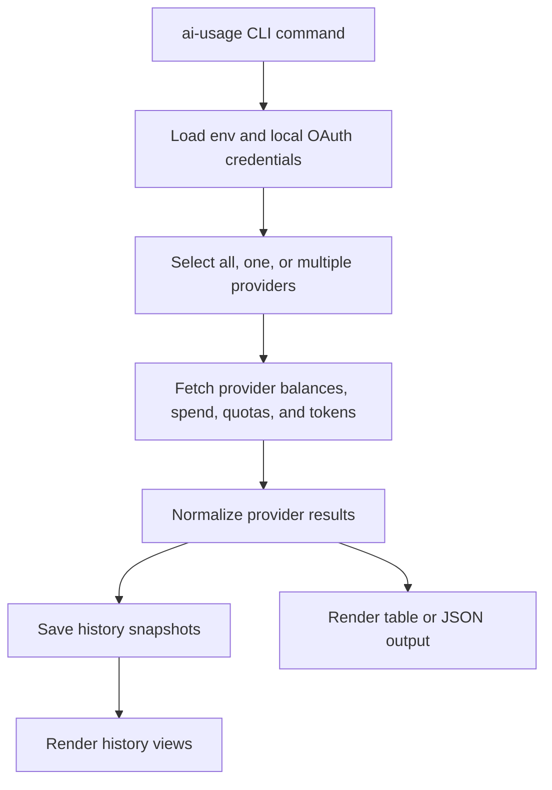

# ai-usage

Cross-provider balance, spend, subscription quota, and token usage — one command.

## Status

| Field | Value |
|---|---|
| Runtime | Python CLI, `ai_usage.cli:main` |
| Package root | `src/ai_usage/` |
| Canonical architecture docs | [`docs/architecture.md`](docs/architecture.md), [`docs/data-architecture.md`](docs/data-architecture.md) |
| Legacy rendered companions | [`architecture.html`](architecture.html), [`data-architecture.html`](data-architecture.html) |

### Architecture map



## Example output

```text
$ ./ai-usage
 Provider       Balance         Spend       Tokens In (Hit)  Tokens In (Miss)  Tokens Out  Tokens Total
─────────────────────────────────────────────────────────────────────────────────────────────────────
 DeepSeek         $6.03          $3.97          118,428,800          7,388,843      379,566    126,197,209
     xAI         $25.00          $0.60              315,968            435,709        2,454        754,131
 Vast.ai          $4.01         $20.99                    —                  —            —              —
     Exa             —           $0.12                    —                  —            —              —
    X API          $24.99          $0.04                    —                  —            —              —
    Nous         $21.74         $20.00                    —                  —            —              —

Subscription Quotas
Subscription      Tier       Resource                 Remaining  Resets In
────────────────  ─────────  ───────────────────────  ─────────  ─────────
Claude Code       Pro        Session                       100%         5h
Claude Code       Pro        Weekly                         82%      4d12h
Codex             Plus       Session                        95%        45m
Codex             Plus       Weekly                         72%       2d2h
Google AI Studio  Ultra 20x  Claude Opus 4.6 (Think)       100%      4h59m
Google AI Studio  Ultra 20x  Gemini 3.1 Pro (High)         100%      4h59m
Google AI Studio  Ultra 20x  Gemini 3.5 Flash (High)       100%      4h59m
```

## Usage

```bash
./ai-usage                          # all providers
./ai-usage help                     # same as --help
./ai-usage -p xai                   # single provider
./ai-usage -p deepseek,xai,codex    # multiple providers
./ai-usage -m                       # per-model token breakdown
./ai-usage -m -p deepseek,xai       # per-model, filtered
./ai-usage -j                       # JSON output
./ai-usage -j -m                    # JSON with per-model breakdown
./ai-usage --history                 # last 10 snapshots (all providers)
./ai-usage --history --history-provider xai  # last 10 for xAI only
./ai-usage --history --limit 30      # last 30 snapshots
```

### JSON output

```json
$ ./ai-usage -j -p deepseek
{
  "deepseek": {
    "balance": 6.03,
    "period_spend": 3.97,
    "tokens_in_hit": 118428800,
    "tokens_in_hit_percentage": 94.1,
    "tokens_in_miss": 7388843,
    "tokens_in_miss_percentage": 5.9,
    "tokens_out": 379566,
    "tokens_total": 126197209
  }
}
```

With `-m`, each provider gets a `models` key:

```json
$ ./ai-usage -j -m -p deepseek
{
  "deepseek": {
    "balance": 6.03,
    "period_spend": 3.97,
    "tokens_in_hit": 118428800,
    ...
    "models": {
      "deepseek-v4-pro": {
        "tokens_in_hit": 118428800,
        "tokens_in_hit_percentage": 94.1,
        "tokens_in_miss": 7388843,
        "tokens_in_miss_percentage": 5.9,
        "tokens_out": 379566,
        "tokens_total": 126197209
      },
      "deepseek-v4-flash": { ... }
    }
  }
}
```

Codex JSON is under the `subscription` branch and contains just session/weekly quota data when the app-server authenticates:

```json
$ ./ai-usage -j -p codex
{
  "subscription": {
    "codex": {
      "plan_type": "plus",
      "session": {
        "used_pct": 45,
        "remaining_pct": 55,
        "duration_mins": 300,
        "resets_at": 1778467926
      },
      "weekly": {
        "used_pct": 7,
        "remaining_pct": 93,
        "duration_mins": 10080,
        "resets_at": 1779054726
      }
    }
  }
}
```

If Codex local OAuth is stale or the CLI is missing, `ai-usage` keeps Codex visible in the subscription table as `Rate Limits — auth failed`; refresh with `codex login`.

Nous uses subscription credits that deplete with usage:

```json
$ ./ai-usage -j -p nous
{
  "nous": {
    "balance": 21.74,
    "period_spend": 20.00,
    "plan_type": "Plus",
    "monthly_charge": 20.00,
    "credits_remaining": 21.74,
    "current_period_end": "2026-06-11T15:17:45.000Z"
  }
}
```

## Providers

| Provider | Balance | Period Spend | Tokens Hit | Tokens Miss | Tokens Out | Per-model |
|----------|---------|-------------|------------|-------------|------------|-----------|
| DeepSeek | ✅ API | ✅ calc from tokens | ✅ platform API | ✅ platform API | ✅ platform API | ✅ |
| xAI | ✅ mgmt API | ✅ invoice API | ✅ invoice API | ✅ invoice API | ✅ invoice API | ✅ |
| Vast.ai | ✅ API | ✅ charges API | — | — | — | — |
| Exa | ✅ dashboard session | ✅ admin API | — | — | — | — |
| X API | ✅ console API | ✅ usage × pricing | — | — | — | — |
| Codex | — | — | — | — | — | — |
| Claude Code | — | — | Local/OAuth usage | Local/OAuth usage | Local/OAuth usage | Provider-specific |
| Nous | ✅ OAuth API | ✅ subscription charge | — | — | — | — |
| Google AI Studio | — | — | — | — | — | — |

Codex uses its own data model: session usage %, weekly usage %, and plan type. No dollar balance or token tracking. Queried via the Codex CLI app-server JSON-RPC interface.

Claude Code uses subscription/rate-limit windows and local/OAuth usage state. Its model details do not map cleanly to the generic dollar-balance rows.

Nous Research uses subscription credits ($20+/mo) that deplete as you use managed services (web search, image gen, TTS, browser). No token tracking — credits are the unit of consumption. Queried via the Portal OAuth account API. Stored in the `api` JSON branch (not `subscription`) since its credit model behaves like API credits.

Google AI Studio uses a compute-based subscription quota model (Ultra 20x plan) that tracks remaining fractions per-model group. No token tracking or dollar balance. Queried via the Cloud Code fetchAvailableModels internal endpoint, using locally configured Google developer credentials.

[Architecture](docs/architecture.md) · [Data architecture](docs/data-architecture.md) · [Audit report](AUDIT.md) · Legacy renders: [architecture.html](architecture.html), [data-architecture.html](data-architecture.html)

## API endpoints

| Provider | Data | Endpoint | Auth |
|----------|------|----------|------|
| DeepSeek | Balance | `GET api.deepseek.com/user/balance` | API key |
| DeepSeek | Token usage | `GET platform.deepseek.com/api/v0/usage/amount` | Platform auth token |
| xAI | Balance | `GET management-api.x.ai/v1/billing/teams/{id}/prepaid/balance` | Management key |
| xAI | Token + spend | `GET management-api.x.ai/v1/billing/teams/{id}/postpaid/invoice/preview` | Management key |
| Vast.ai | Balance | `GET console.vast.ai/api/v0/users/current/` | API key |
| Vast.ai | Spend | `GET cloud.vast.ai/api/v0/charges/` (current month) | API key |
| Exa | Balance | `GET dashboard.exa.ai/api/get-orb-balance` | Session cookie |
| Exa | Spend | `GET admin-api.exa.ai/team-management/api-keys/{id}/usage` | Service key |
| X API | Balance | `GET console.x.com/api/accounts/{id}/credits` | Session cookies |
| X API | Spend | `GET console.x.com/api/accounts/{id}/usage` + pricing | Session cookies |
| Codex | Session/weekly quota rows | `codex app-server` JSON-RPC `account/rateLimits/read` | OAuth (~/.codex/auth.json; stale/missing auth stays visible as `auth failed`) |
| Claude | Session/weekly + tokens | `GET api.anthropic.com/api/oauth/usage` + local files | OAuth (`~/.claude/.credentials.json`, refreshed through Claude Code CLI) |
| Nous | Subscription credits | `GET portal.nousresearch.com/api/oauth/account` | OAuth (~/.hermes/auth.json) |
| Google AI Studio | Model quotas | `POST cloudcode-pa.googleapis.com/v1internal:fetchAvailableModels` | OAuth (~/.hermes/auth/google_oauth.json) |

## Setup

Add to `~/.hermes/.env`:

```bash
DEEPSEEK_API_KEY=sk-...            # from platform.deepseek.com/api_keys
DEEPSEEK_AUTH_TOKEN=...            # from platform.deepseek.com Network tab
XAI_MANAGEMENT_KEY=xai-token-...   # from console.x.ai/team/default/management-keys
XAI_TEAM_ID=...                    # UUID from management keys page
VASTAI_API_KEY=***                 # from cloud.vast.ai/manage-keys
EXA_SERVICE_KEY=***                # from dashboard.exa.ai (service key, not search key)
EXA_SESSION_TOKEN=***              # from dashboard.exa.ai Network tab (expires, see below)
X_API_AUTH_TOKEN=***               # from console.x.com Network tab → auth_token cookie
X_API_CT0=***                      # from console.x.com Network tab → ct0 cookie
X_API_ACCOUNT_ID=***               # from console.x.com URL /accounts/{id}
```

Codex requires the Codex CLI installed and authenticated:

```bash
npm i -g @openai/codex-cli
codex login
```

Claude Code reads local config files automatically (`~/.claude.json`, `~/.claude/stats-cache.json`, `~/.claude/.credentials.json`). No separate setup is needed beyond having Claude Code installed and authenticated. If the cached OAuth access token is expired or the usage endpoint returns an auth/rate-limit status, `ai-usage` runs a minimal Claude Code CLI prompt to let Claude refresh its own credentials, then retries the usage endpoint with the fresh token.

Nous reads the OAuth token from `~/.hermes/auth.json` (set up by `hermes model` or the Hermes setup wizard). No manual credential needed if you've already configured Nous Portal as a provider in Hermes.

Google AI Studio reads Google OAuth credentials from `~/.hermes/auth/google_oauth.json` (written by the Hermes CLI when authenticating the `google-agy` provider). It handles refresh-token rotation and GCP project ID resolution under the hood dynamically.

### Credential refresh

Three browser-session credentials expire — `DEEPSEEK_AUTH_TOKEN`, `EXA_SESSION_TOKEN`, and the X API cookies. Claude Code, Nous, Google, and Codex use OAuth-managed credentials that auto-refresh through their owning tools. All other credentials are long-lived.

**DeepSeek:** When token usage shows `—`, refresh:
1. Open https://platform.deepseek.com/usage in Chrome
2. Press F12 → Network tab → refresh the page
3. Find any request to `platform.deepseek.com` → copy the `Authorization: Bearer ***` header value
4. Update `DEEPSEEK_AUTH_TOKEN` in `~/.hermes/.env`

**Exa:** When balance shows `—`, refresh:
1. Open https://dashboard.exa.ai/new-billing in Chrome
2. Press F12 → Network tab → refresh the page
3. Find the request to `get-orb-balance` → click it → Cookies tab
4. Copy the `next-auth.session-token` value
5. Update `EXA_SESSION_TOKEN` in `~/.hermes/.env`

**X API:** When balance shows `—`, refresh:
1. Open https://console.x.com in Chrome
2. Press F12 → Network tab → refresh
3. Find any request → Cookies tab → copy `auth_token` and `ct0`
4. Update `X_API_AUTH_TOKEN` and `X_API_CT0` in `~/.hermes/.env`

**Codex:** OAuth normally refreshes through the Codex CLI app-server. If the app-server returns an auth error such as `token_expired` / `refresh_token_reused`, the quota table shows `auth failed` instead of dropping Codex silently. Run `codex login` to replace `~/.codex/auth.json`.

**Claude Code:** OAuth token auto-refreshes through the Claude Code CLI. `ai-usage` refreshes proactively when the cached token expires within two hours and retries once after `401`, `403`, or `429` from the OAuth usage endpoint. The refresh command is intentionally tiny (`claude -p ping --effort low --max-turns 1 --output-format json --no-session-persistence`) but can still consume a small amount of Claude Code rate-limit quota. If refresh fails, the quota table shows `auth failed` instead of the older misleading `403 blocked` label.
