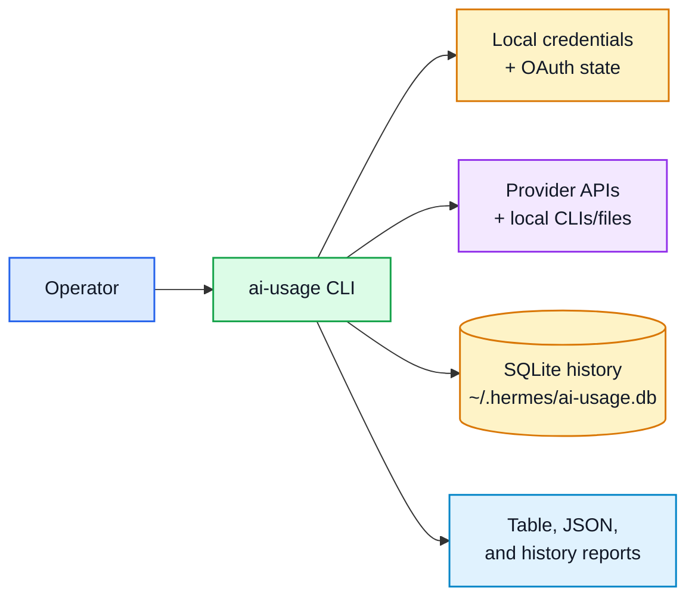

# ai-usage Executive Brief

> Purpose: describe the business value, maturity, and risk boundary of `ai-usage` without requiring code-level context.

| Field | Value |
|---|---|
| Audience | Operators, maintainers, and decision-makers who need the why before the implementation |
| Status | Active workstation utility |
| Last updated | 2026-06-28 |
| Source of truth | `README.md`, `src/ai_usage/`, `tests/`, and `docs/architecture/` |

## One-sentence value

`ai-usage` gives the operator a single command for cross-provider balance, spend, subscription quota, token-usage, and local history visibility across the AI services used by the workstation.

## Executive mental model

## What it makes visible

| Visibility area | What `ai-usage` shows | Source |
|---|---|---|
| API-credit providers | Balance, period spend, and token totals where exposed | Provider adapters under `src/ai_usage/providers/`; README provider/API tables |
| Subscription providers | Session/weekly quota windows and per-account Codex quotas | `codex.py`, `claude.py`, `google.py`, and renderer subscription tables |
| Local history | Saved normalized snapshots and provider-filtered history reads | `src/ai_usage/db.py` and `--history` CLI path |
| Machine-readable output | JSON separated into `api` and `subscription` branches | `src/ai_usage/render.py` |
| Failure posture | Auth failures, skipped providers, and partial API errors stay visible instead of hiding rows | `ProviderData.meta` handling in providers and renderers |

## Maturity posture

| Signal | Current state | Evidence |
|---|---|---|
| Provider breadth | 10 registered providers | `src/ai_usage/cli.py` imports and provider registry |
| Test inventory | Generated from source and drift-checked | `docs/TESTS.md` + `scripts/generate_test_inventory.py` |
| Runtime suite | 112 pytest-collected tests passed in baseline validation | `.venv/bin/python -m pytest tests/ -v --cov=ai_usage` on 2026-06-28 |
| Architecture depth | 5 C4 views plus source-level Mermaid docs | `docs/architecture/workspace.dsl`, `docs/architecture/c4-diagrams.md` |
| Decision history | 3 accepted ADRs | `docs/architecture/adr/README.md` |

## Risk boundary

`ai-usage` is a local reporting utility, not a credential vault or billing authority. It reads credentials from local files, calls provider APIs or local developer-tool state, normalizes only the fields needed for reports, and persists snapshot rows rather than raw provider payloads.

| Risk | Boundary in this repo |
|---|---|
| Credential leakage | Documentation uses environment-variable names and file paths only; real values stay outside the repo. |
| Misleading subscription status | Google entitlement detection is separated from quota availability; Codex account failures stay account-scoped. |
| Provider outage or stale auth | Provider-specific failures render as visible metadata, skipped rows, or auth-failed quota rows. |
| Documentation drift | Test inventory, high-level doc, and HTML companions are generated and checked. |

## Where to go next

| Need | Start here |
|---|---|
| Run the tool | [`USER_GUIDE.md`](USER_GUIDE.md) |
| Inspect exact commands, provider setup, and endpoint table | [`../README.md`](../README.md) |
| Review the normalized data model | [`data-architecture.md`](data-architecture.md) |
| Review topology and maintainer diagrams | [`architecture/README.md`](architecture/README.md) |
| Verify the test surface | [`TESTS.md`](TESTS.md) |
