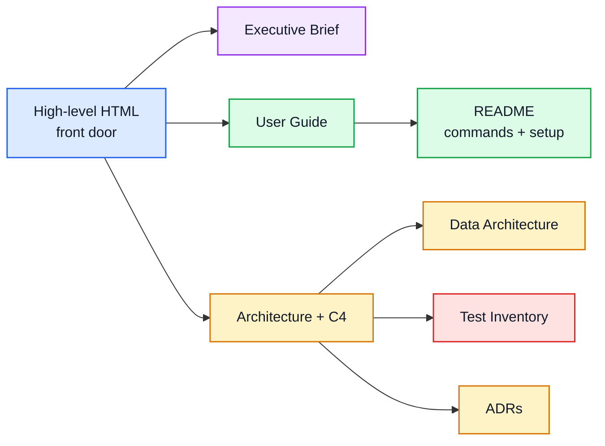

# ai-usage Documentation Map

> Purpose: route readers to the right altitude while keeping Markdown canonical and rendered HTML companions drift-checked.

| Field | Value |
|---|---|
| Owner | Mike Nicks |
| Status | Active |
| Last updated | 2026-06-28 |
| Visual front door | [`../ai-usage-high-level-doc.html`](../ai-usage-high-level-doc.html) |
| Generated companions | `docs/*.html`, `README.html`, and `AGENTS.html` from `scripts/render_docs.py` |

## Reading path



## Audience routes

| If you are... | Start with | Then read |
|---|---|---|
| Deciding whether the tool is mature enough to rely on | [`EXECUTIVE_BRIEF.md`](EXECUTIVE_BRIEF.md) | [`TESTS.md`](TESTS.md), [`architecture/README.md`](architecture/README.md) |
| Running the CLI day to day | [`USER_GUIDE.md`](USER_GUIDE.md) | [`../README.md`](../README.md) |
| Adding or changing a provider | [`architecture.md`](architecture.md) | [`data-architecture.md`](data-architecture.md), [`architecture/adr/README.md`](architecture/adr/README.md) |
| Verifying generated docs and diagrams | [`TESTS.md`](TESTS.md) | [`architecture/README.md`](architecture/README.md) |

## Documentation ownership

| Document | Owns | Altitude |
|---|---|---|
| [`../ai-usage-high-level-doc.html`](../ai-usage-high-level-doc.html) | Polished visual overview and browser front door | 50,000 ft |
| [`EXECUTIVE_BRIEF.md`](EXECUTIVE_BRIEF.md) | Value, maturity, and risk boundary | 30,000 ft |
| [`USER_GUIDE.md`](USER_GUIDE.md) | First-run journey and operator task routing | 10,000 ft |
| [`../README.md`](../README.md) | Exact CLI usage, provider/API table, credential setup | Ground |
| [`architecture.md`](architecture.md) | Source-level component model and live-fetch flow | Maintainer |
| [`data-architecture.md`](data-architecture.md) | Normalized data model and provider-field mapping | Maintainer |
| [`architecture/README.md`](architecture/README.md) | C4 model-as-code workflow and generated artifact contract | Maintainer |
| [`architecture/c4-diagrams.md`](architecture/c4-diagrams.md) | Generated C4 diagram atlas | Maintainer |
| [`architecture/adr/README.md`](architecture/adr/README.md) | Accepted architecture decisions | Maintainer |
| [`TESTS.md`](TESTS.md) | Generated test inventory and verification commands | Verify |

## Generated artifact contract

Markdown files are the canonical source for review and diffs. HTML companions are generated artifacts for browser reading:

`render_docs.py` expects the docs build environment to have `markdown`, `pygments`, `mmdc`, and a Puppeteer/Chrome headless-shell available. These are build-time tools only; generated HTML is self-contained.

```bash
python scripts/generate_test_inventory.py --write
python scripts/generate_showcase.py --spec scripts/showcase.spec.json
python scripts/render_docs.py --repo . --slug ai-usage
```

Before committing documentation changes, run the matching checks:

```bash
python scripts/generate_test_inventory.py --check
python scripts/generate_showcase.py --spec scripts/showcase.spec.json --check
python scripts/render_docs.py --repo . --slug ai-usage --check
```

Do not hand-edit generated HTML companions. Update the Markdown or `scripts/showcase.spec.json`, regenerate, and commit source plus generated output together.
