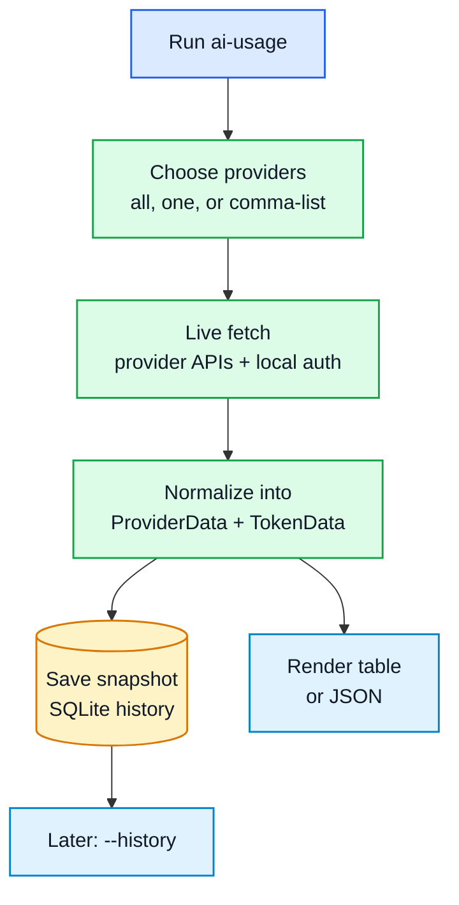

# ai-usage User Guide

> Purpose: give an operator the fastest safe path from first run to useful balance, quota, token, JSON, and history reports.

| Field | Value |
|---|---|
| Audience | Daily operator of the CLI |
| Status | Active |
| Last updated | 2026-06-28 |
| Runtime | Python 3.10+ CLI exposed as `ai-usage` / `./ai-usage` |

## The mental model

`ai-usage` has one job: fetch the current provider picture, normalize it, and show it either as a table, JSON, or saved history.



## First run

```bash
./ai-usage
```

That default command selects every registered provider, loads credentials from `~/.hermes/.env` and local OAuth files, fetches what each provider can expose, saves a normalized snapshot, and prints a table.

If a provider is not configured, the row should stay visible as blank, skipped, or auth-failed rather than making the entire command useless.

## Common tasks

| I want to... | Run | What to expect |
|---|---|---|
| See everything | `./ai-usage` | API-credit rows plus subscription quota rows where available. |
| Check one provider | `./ai-usage -p xai` | Only the named provider is built and fetched. |
| Check a small group | `./ai-usage -p deepseek,xai,openrouter,codex` | A comma-separated provider list with the same output model. |
| Include model/token breakdowns | `./ai-usage -m` | Extra model rows for providers that expose per-model data. |
| Emit machine-readable output | `./ai-usage -j` | JSON with top-level `api` and/or `subscription` branches. |
| Combine JSON and model detail | `./ai-usage -j -m -p deepseek` | Provider JSON with a `models` object when model detail exists. |
| Review recent snapshots | `./ai-usage --history` | Last 10 fetch groups across all providers. |
| Filter history | `./ai-usage --history --history-provider xai` | Recent rows for one provider. |
| Increase history depth | `./ai-usage --history --history-limit 30` | More fetch groups. |
| Refresh Nous OAuth state | `./ai-usage --refresh-auth nous` | Refresh message and exit status for cached Nous auth. |
| Show help | `./ai-usage help` | The built-in command reference. |

## Provider setup in one table

| Provider group | Credential source | Notes |
|---|---|---|
| DeepSeek, xAI, OpenRouter, Vast.ai, Exa, X API | `~/.hermes/.env` plus Vast.ai key fallback | Browser-session tokens for DeepSeek usage, Exa, and X API can expire. |
| Codex | Hermes `credential_pool.openai-codex`; fallback Codex CLI OAuth | Multi-account quotas render per Hermes account label. |
| Claude Code | Claude local OAuth/config files | The CLI can run a tiny Claude Code refresh prompt when token state is stale. |
| Nous | `~/.hermes/auth.json` | OAuth refresh is automatic when refresh state is present; `--refresh-auth nous` is available. |
| Google AI Studio | `~/.hermes/auth/google_oauth.json` | Entitlement source and quota source are kept separate. |

Full variable names and endpoint details live in [`../README.md`](../README.md).

## Output rules worth remembering

- API-credit providers render in the main table and JSON `api` branch.
- Codex, Claude Code, and Google AI Studio render as subscription quota rows and JSON `subscription` data.
- DeepSeek and xAI expose token totals; use `-m` for per-model rows when the provider response includes model detail.
- Skipped or partially unavailable providers should leave a visible reason in table output or JSON metadata.
- History stores normalized snapshot rows; raw provider payloads are not the documentation or history source.

## The one safety rule

Never paste real credential values into docs, commits, screenshots, or command examples. Put credentials in the supported local files and use variable names or `[REDACTED]` placeholders in documentation.

## Troubleshooting

| Symptom | Likely cause | Start here |
|---|---|---|
| Provider row is blank or says `auth missing` | Required credential is absent or expired | README setup section and provider-specific refresh notes. |
| Exa is skipped | `EXA_ENABLED=true` is not set | Add it to the environment or `~/.hermes/.env` when you want Exa dashboard/admin calls. |
| Codex shows only auth failure | Hermes pool account is stale or no Codex CLI fallback is authenticated | Refresh/re-add the Hermes Codex account or run `codex login` for fallback. |
| Claude quota fails | Claude local OAuth state is stale and refresh failed | Check Claude Code local auth and rerun. |
| Google tier looks free but quotas exist | Entitlement and quota sources are intentionally separate | See ADR-0003 and `docs/data-architecture.md`. |

## Verification for maintainers

```bash
python scripts/generate_test_inventory.py --check
python scripts/generate_showcase.py --spec scripts/showcase.spec.json --check
python scripts/render_docs.py --repo . --slug ai-usage --check
.venv/bin/python -m pytest tests/ -v --cov=ai_usage
```
