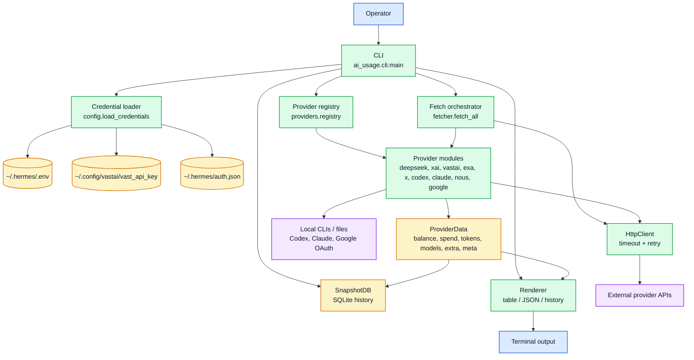
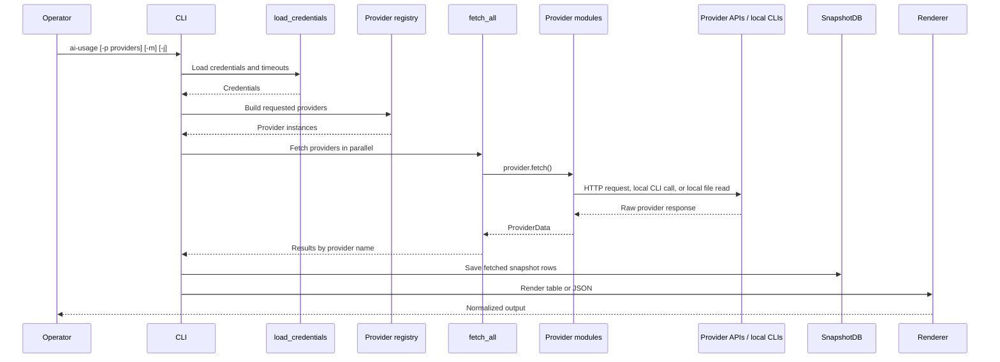

# ai-usage Architecture

| Field | Value |
|---|---|
| Status | Active local workstation utility |
| Source of truth | Markdown and Mermaid in this file |
| Runtime entry point | `ai_usage.cli:main` / `ai-usage` |
| Implementation root | `src/ai_usage/` |
| Legacy rendered companions | `architecture.html`, `data-architecture.html` |

## Scope

`ai-usage` is a Python CLI that fetches account balance, spend, subscription quota, and token-usage data across provider APIs, normalizes those responses into `ProviderData`, stores snapshots in SQLite, and renders table or JSON output.

This document describes the current source-level architecture. The HTML files in the repo are historical rendered diagrams; Markdown/Mermaid is the canonical documentation source going forward.

## Component model

## Live-fetch flow

## Registered providers

| Provider key | Display name | Result type | Primary source |
|---|---|---|---|
| `deepseek` | DeepSeek | Balance, spend, token usage | DeepSeek API + platform usage API |
| `xai` | xAI | Balance, spend, token usage | xAI management billing APIs |
| `vastai` | Vast.ai | Balance and spend | Vast.ai user and charges APIs |
| `exa` | Exa | Balance and spend | Exa dashboard/admin APIs |
| `x` | X API | Credit balance and spend | X console API |
| `codex` | Codex | Subscription/session quota with interactive auth-retry fallback | `codex app-server` JSON-RPC |
| `claude` | Claude Code | Subscription/session quota and local usage | Anthropic OAuth usage API + Claude local files + Claude CLI refresh |
| `nous` | Nous | Subscription credits | Nous Portal OAuth API |
| `google` | Google AI Studio | Model quota rows with OAuth refresh retry | Cloud Code internal model/quota endpoint |

## Data boundaries

- Credential values live outside the repo and must not be copied into Markdown.
- Provider errors are normalized into `ProviderData.meta` rather than crashing the whole table where possible; Codex auth failures trigger one interactive `codex login` retry on TTY and otherwise render as `auth failed` instead of disappearing from the subscription table.
- `SnapshotDB` stores normalized numeric output for history; raw provider payloads are not the documentation source.
- Codex, Claude, Google, and Nous have quota/subscription semantics that do not map cleanly to a simple dollar balance row.
- Claude OAuth refresh is delegated to the Claude Code CLI with a minimal prompt when the cached access token is near expiry or the usage endpoint rejects it with an auth/rate-limit status.
- Google OAuth refresh runs before expiry and retries once after auth/rate-limit statuses from the Cloud Code quota endpoint.

## Maintenance notes

- Add a provider by creating a dedicated module under `src/ai_usage/providers/`, registering it, and updating the README provider/API tables.
- Do not turn provider-specific quirks into broad flags on existing providers unless the implementation already uses that pattern.
- Keep `docs/data-architecture.md` synchronized when endpoint fields or normalized output fields change.
