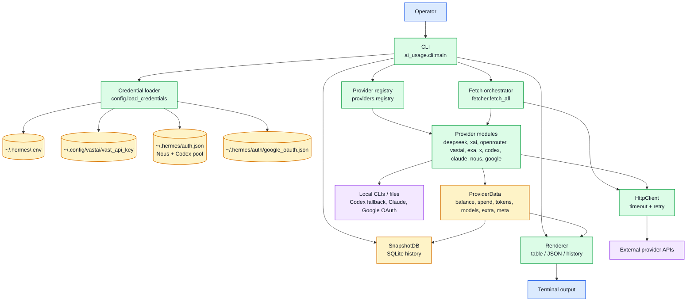
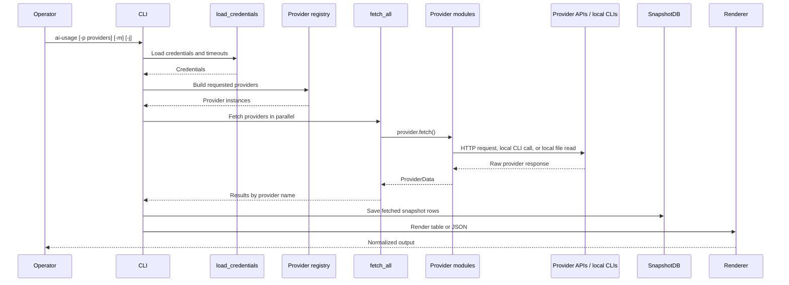

# ai-usage Architecture

| Field | Value |
|---|---|
| Status | Active local workstation utility |
| Source of truth | Source-level Markdown and Mermaid in this file; C4 topology source in `docs/architecture/workspace.dsl` |
| Runtime entry point | `ai_usage.cli:main` / `ai-usage` |
| Implementation root | `src/ai_usage/` |
| Legacy rendered companions | `architecture.html`, `data-architecture.html` |

## Scope

`ai-usage` is a Python CLI that fetches account balance, spend, subscription quota, and token-usage data across provider APIs, normalizes those responses into `ProviderData`, stores snapshots in SQLite, renders table or JSON output, and exposes a small provider-auth refresh helper for Nous OAuth state.

This document describes the current source-level architecture. The HTML files in the repo are historical rendered diagrams; Markdown/Mermaid is the canonical documentation source for this narrative. For C4 model-as-code topology and generated diagram artifacts, see [`docs/architecture/README.md`](architecture/README.md) and [`docs/architecture/workspace.dsl`](architecture/workspace.dsl).

## Component model

## Live-fetch flow

## Registered providers

| Provider key | Display name | Result type | Primary source |
|---|---|---|---|
| `deepseek` | DeepSeek | Balance, spend, token usage | DeepSeek API + platform usage API |
| `xai` | xAI | Balance, spend, token usage | xAI management billing APIs |
| `openrouter` | OpenRouter | Credit balance and key monthly spend | OpenRouter credits and key APIs |
| `vastai` | Vast.ai | Balance and spend | Vast.ai user and charges APIs |
| `exa` | Exa | Balance and spend | Exa dashboard/admin APIs |
| `x` | X API | Credit balance and spend | X console API |
| `codex` | Codex | Subscription/session quota per Hermes credential-pool account with interactive CLI fallback | Hermes `credential_pool.openai-codex` + Codex usage API; fallback `codex app-server` JSON-RPC |
| `claude` | Claude Code | Subscription/session quota and local usage | Anthropic OAuth usage API + Claude local files + Claude CLI refresh |
| `nous` | Nous | Subscription credits with OAuth refresh retry | Nous Portal OAuth account and token APIs |
| `google` | Google AI Studio | Entitlement tier plus model quota rows with OAuth refresh retry | Cloud Code internal entitlement and model/quota endpoints |

## Data boundaries

- Credential values live outside the repo and must not be copied into Markdown.
- Provider errors and intentional skips are normalized into `ProviderData.meta` rather than crashing the whole table where possible. `meta.skip_reason` renders directly in otherwise blank table rows and JSON includes `status`, `reason`, and safe `detail` fields for skipped providers. Codex pool-account failures stay account-scoped and render as `auth failed`/`api error` rows without hiding other Codex accounts. The legacy single-account app-server fallback still triggers one interactive `codex login` retry on TTY and otherwise renders as `auth failed`.
- `SnapshotDB` stores normalized numeric output for history; raw provider payloads are not the documentation source. Multi-account Codex snapshots are stored under account-qualified provider keys such as `codex:primary` so history does not collapse separate subscriptions.
- Codex, Claude, Google, and Nous have quota/subscription semantics that do not map cleanly to a simple dollar balance row.
- Exa dashboard/admin calls are intentionally disabled unless `EXA_ENABLED=true` is loaded from the environment or `~/.hermes/.env`.
- Claude OAuth refresh is delegated to the Claude Code CLI with a minimal prompt when the cached access token is near expiry or the usage endpoint rejects it with an auth/rate-limit status. Claude tier display prefers OAuth `subscriptionType` and falls back to local `oauthAccount.organizationType`; billing transport labels are not displayed as tiers.
- Nous OAuth refresh runs before expiry, retries once after `401`/`403` account API responses, and can be forced with `ai-usage --refresh-auth nous` when `~/.hermes/auth.json` includes a Nous refresh token.
- Google OAuth refresh runs before expiry and retries once after auth/rate-limit statuses from the Cloud Code entitlement or quota endpoints. Google tier display is based on `loadCodeAssist` tier fields, while quota rows remain based on model availability from `fetchAvailableModels`.

## Maintenance notes

- Add a provider by creating a dedicated module under `src/ai_usage/providers/`, registering it, and updating the README provider/API tables.
- Do not turn provider-specific quirks into broad flags on existing providers unless the implementation already uses that pattern.
- Keep `docs/data-architecture.md` synchronized when endpoint fields or normalized output fields change.
