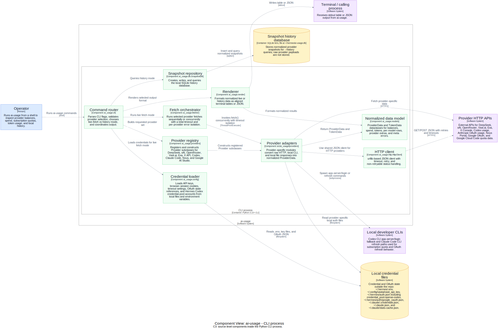
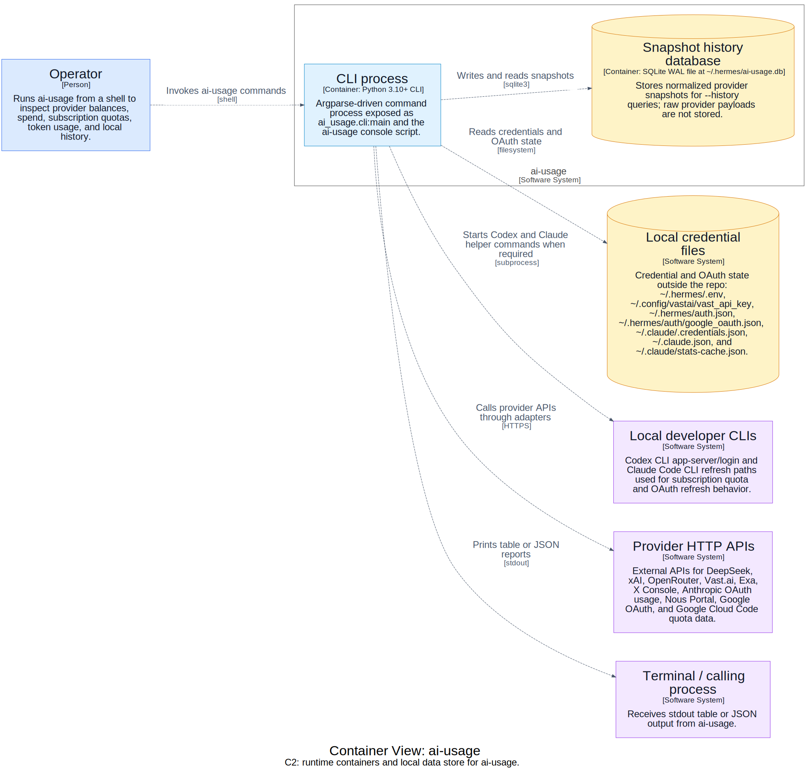
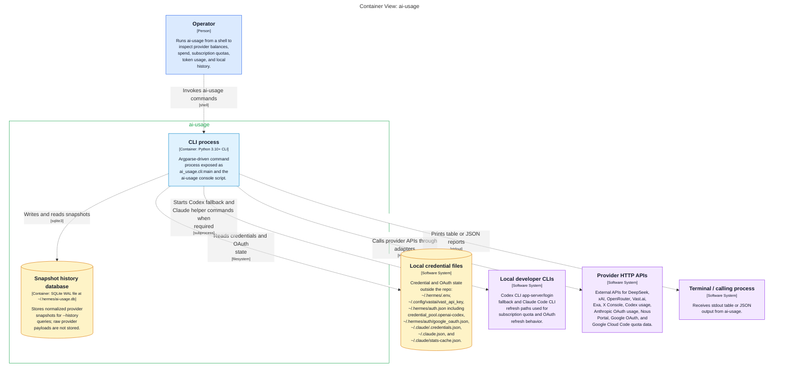
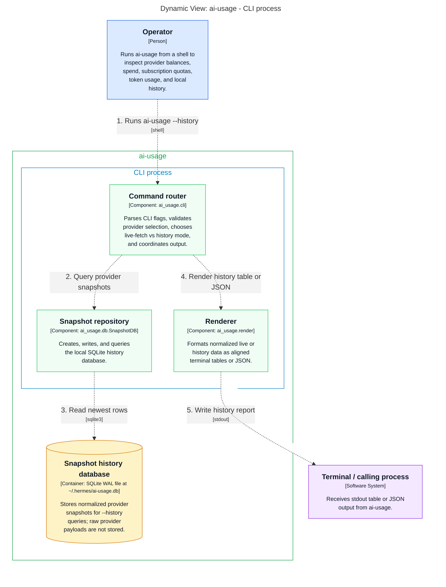
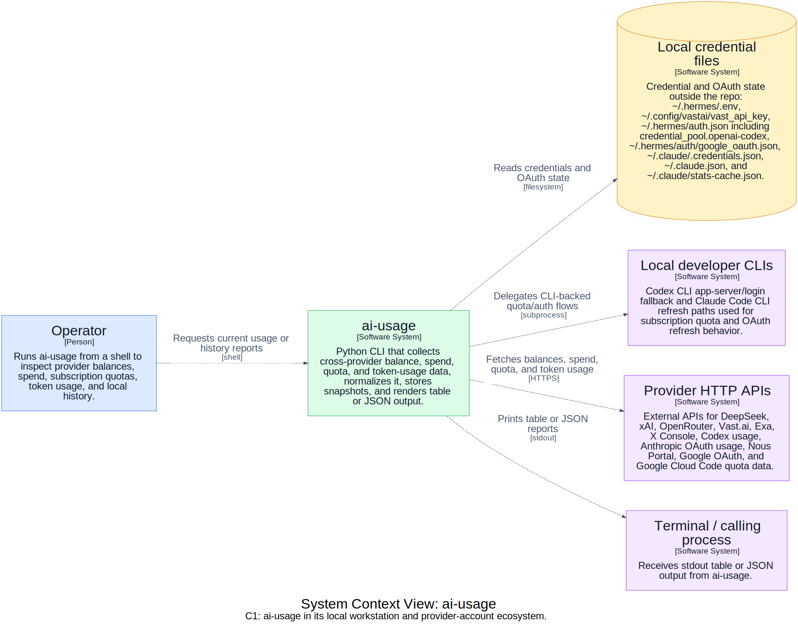
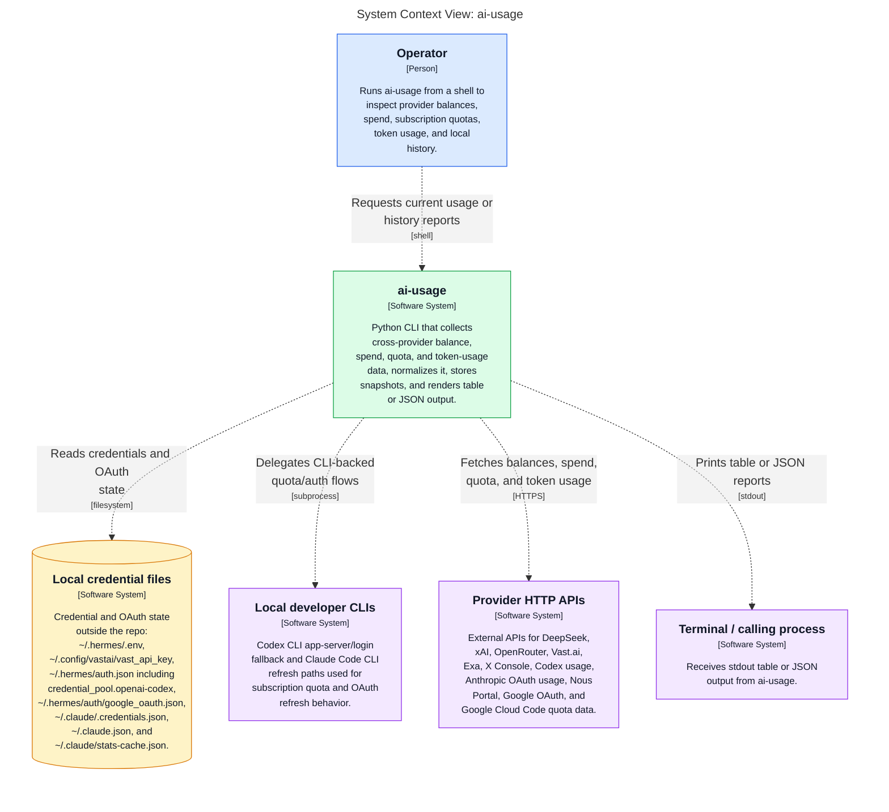

```mermaid
graph LR
  linkStyle default fill:#ffffff

  subgraph diagram ["Component View: ai-usage - CLI process"]
    style diagram fill:#ffffff,stroke:#ffffff

    1["<div style='font-weight: bold'>Operator</div><div style='font-size: 70%; margin-top: 0px'>[Person]</div><div style='font-size: 80%; margin-top:10px'>Runs ai-usage from a shell to<br />inspect provider balances,<br />spend, subscription quotas,<br />token usage, and local<br />history.</div>"]
    style 1 fill:#dbeafe,stroke:#2563eb,color:#111827

    14[("<div style='font-weight: bold'>Local credential files</div><div style='font-size: 70%; margin-top: 0px'>[Software System]</div><div style='font-size: 80%; margin-top:10px'>Credential and OAuth state<br />outside the repo:<br />~/.hermes/.env,<br />~/.config/vastai/vast_api_key,<br />~/.hermes/auth.json including<br />credential_pool.openai-codex,<br />~/.hermes/auth/google_oauth.json,<br />~/.claude/.credentials.json,<br />~/.claude.json, and<br />~/.claude/stats-cache.json.</div>")]
    style 14 fill:#fef3c7,stroke:#d97706,color:#111827
    15["<div style='font-weight: bold'>Local developer CLIs</div><div style='font-size: 70%; margin-top: 0px'>[Software System]</div><div style='font-size: 80%; margin-top:10px'>Codex CLI app-server/login<br />fallback and Claude Code CLI<br />refresh paths used for<br />subscription quota and OAuth<br />refresh behavior.</div>"]
    style 15 fill:#f3e8ff,stroke:#9333ea,color:#111827
    16["<div style='font-weight: bold'>Provider HTTP APIs</div><div style='font-size: 70%; margin-top: 0px'>[Software System]</div><div style='font-size: 80%; margin-top:10px'>External APIs for DeepSeek,<br />xAI, OpenRouter, Vast.ai,<br />Exa, X Console, Codex usage,<br />Anthropic OAuth usage, Nous<br />Portal, Google OAuth, and<br />Google Cloud Code quota data.</div>"]
    style 16 fill:#f3e8ff,stroke:#9333ea,color:#111827
    17["<div style='font-weight: bold'>Terminal / calling process</div><div style='font-size: 70%; margin-top: 0px'>[Software System]</div><div style='font-size: 80%; margin-top:10px'>Receives stdout table or JSON<br />output from ai-usage.</div>"]
    style 17 fill:#f3e8ff,stroke:#9333ea,color:#111827

    subgraph 2 ["ai-usage"]
      style 2 fill:#ffffff,stroke:#16a34a,color:#16a34a

      subgraph 3 ["CLI process"]
        style 3 fill:#ffffff,stroke:#0284c7,color:#0284c7

        10["<div style='font-weight: bold'>Normalized data model</div><div style='font-size: 70%; margin-top: 0px'>[Component: ai_usage.models]</div><div style='font-size: 80%; margin-top:10px'>ProviderData and TokenData<br />dataclasses for balances,<br />spend, tokens, per-model<br />rows, provider extras, and<br />meta errors.</div>"]
        style 10 fill:#f0fdf4,stroke:#22c55e,color:#111827
        11["<div style='font-weight: bold'>Snapshot repository</div><div style='font-size: 70%; margin-top: 0px'>[Component: ai_usage.db.SnapshotDB]</div><div style='font-size: 80%; margin-top:10px'>Creates, writes, and queries<br />the local SQLite history<br />database.</div>"]
        style 11 fill:#f0fdf4,stroke:#22c55e,color:#111827
        12["<div style='font-weight: bold'>Renderer</div><div style='font-size: 70%; margin-top: 0px'>[Component: ai_usage.render]</div><div style='font-size: 80%; margin-top:10px'>Formats normalized live or<br />history data as aligned<br />terminal tables or JSON.</div>"]
        style 12 fill:#f0fdf4,stroke:#22c55e,color:#111827
        4["<div style='font-weight: bold'>Command router</div><div style='font-size: 70%; margin-top: 0px'>[Component: ai_usage.cli]</div><div style='font-size: 80%; margin-top:10px'>Parses CLI flags, validates<br />provider selection, chooses<br />live-fetch vs history mode,<br />and coordinates output.</div>"]
        style 4 fill:#f0fdf4,stroke:#22c55e,color:#111827
        5["<div style='font-weight: bold'>Credential loader</div><div style='font-size: 70%; margin-top: 0px'>[Component: ai_usage.config]</div><div style='font-size: 80%; margin-top:10px'>Loads API keys,<br />browser-session cookies,<br />timeout settings, OAuth state<br />references, and Hermes Codex<br />credential-pool accounts from<br />local files and environment<br />variables.</div>"]
        style 5 fill:#f0fdf4,stroke:#22c55e,color:#111827
        6["<div style='font-weight: bold'>Provider registry</div><div style='font-size: 70%; margin-top: 0px'>[Component: ai_usage.providers]</div><div style='font-size: 80%; margin-top:10px'>Registers and constructs<br />Provider subclasses for<br />DeepSeek, xAI, OpenRouter,<br />Vast.ai, Exa, X API, Codex,<br />Claude Code, Nous, and Google<br />AI Studio.</div>"]
        style 6 fill:#f0fdf4,stroke:#22c55e,color:#111827
        7["<div style='font-weight: bold'>Fetch orchestrator</div><div style='font-size: 70%; margin-top: 0px'>[Component: ai_usage.fetcher]</div><div style='font-size: 80%; margin-top:10px'>Runs selected provider<br />fetches sequentially or<br />concurrently with a total<br />timeout and per-provider<br />error isolation.</div>"]
        style 7 fill:#f0fdf4,stroke:#22c55e,color:#111827
        8["<div style='font-weight: bold'>Provider adapters</div><div style='font-size: 70%; margin-top: 0px'>[Component: src/ai_usage/providers]</div><div style='font-size: 80%; margin-top:10px'>Provider-specific modules<br />convert raw HTTP, local CLI,<br />and local file responses into<br />normalized ProviderData.</div>"]
        style 8 fill:#f0fdf4,stroke:#22c55e,color:#111827
        9["<div style='font-weight: bold'>HTTP client</div><div style='font-size: 70%; margin-top: 0px'>[Component: ai_usage.http.HttpClient]</div><div style='font-size: 80%; margin-top:10px'>urllib-based JSON client with<br />timeout, retry, and<br />non-retryable status<br />handling.</div>"]
        style 9 fill:#f0fdf4,stroke:#22c55e,color:#111827
      end

      13[("<div style='font-weight: bold'>Snapshot history database</div><div style='font-size: 70%; margin-top: 0px'>[Container: SQLite WAL file at ~/.hermes/ai-usage.db]</div><div style='font-size: 80%; margin-top:10px'>Stores normalized provider<br />snapshots for --history<br />queries; raw provider<br />payloads are not stored.</div>")]
      style 13 fill:#fef3c7,stroke:#d97706,color:#111827
    end

    1-. "<div>Runs ai-usage commands</div><div style='font-size: 70%'>[shell]</div>" .->4
    4-. "<div>Loads credentials for live<br />fetch mode</div><div style='font-size: 70%'></div>" .->5
    4-. "<div>Builds requested provider set</div><div style='font-size: 70%'></div>" .->6
    4-. "<div>Runs live fetch mode</div><div style='font-size: 70%'></div>" .->7
    4-. "<div>Queries history mode</div><div style='font-size: 70%'></div>" .->11
    4-. "<div>Renders selected output<br />format</div><div style='font-size: 70%'></div>" .->12
    5-. "<div>Reads .env, key files, and<br />OAuth JSON</div><div style='font-size: 70%'>[filesystem]</div>" .->14
    6-. "<div>Constructs registered<br />Provider subclasses</div><div style='font-size: 70%'></div>" .->8
    7-. "<div>Invokes fetch() concurrently<br />with timeout isolation</div><div style='font-size: 70%'>[ThreadPoolExecutor]</div>" .->8
    8-. "<div>Use shared JSON client for<br />HTTP providers</div><div style='font-size: 70%'></div>" .->9
    8-. "<div>Spawn app-server/login or<br />refresh commands</div><div style='font-size: 70%'>[subprocess]</div>" .->15
    8-. "<div>Read provider-specific local<br />auth files</div><div style='font-size: 70%'>[filesystem]</div>" .->14
    8-. "<div>Fetch provider-specific data</div><div style='font-size: 70%'>[HTTPS]</div>" .->16
    8-. "<div>Return ProviderData and<br />TokenData</div><div style='font-size: 70%'></div>" .->10
    9-. "<div>GET/POST JSON with retries<br />and timeouts</div><div style='font-size: 70%'>[HTTPS]</div>" .->16
    11-. "<div>Insert and query normalized<br />snapshots</div><div style='font-size: 70%'>[sqlite3]</div>" .->13
    12-. "<div>Formats normalized results</div><div style='font-size: 70%'></div>" .->10
    12-. "<div>Writes table or JSON</div><div style='font-size: 70%'>[stdout]</div>" .->17

  end
```

```mermaid
graph LR
  linkStyle default fill:#ffffff

  subgraph diagram ["Dynamic View: ai-usage - CLI process"]
    style diagram fill:#ffffff,stroke:#ffffff

    1["<div style='font-weight: bold'>Operator</div><div style='font-size: 70%; margin-top: 0px'>[Person]</div><div style='font-size: 80%; margin-top:10px'>Runs ai-usage from a shell to<br />inspect provider balances,<br />spend, subscription quotas,<br />token usage, and local<br />history.</div>"]
    style 1 fill:#dbeafe,stroke:#2563eb,color:#111827

    15["<div style='font-weight: bold'>Local developer CLIs</div><div style='font-size: 70%; margin-top: 0px'>[Software System]</div><div style='font-size: 80%; margin-top:10px'>Codex CLI app-server/login<br />fallback and Claude Code CLI<br />refresh paths used for<br />subscription quota and OAuth<br />refresh behavior.</div>"]
    style 15 fill:#f3e8ff,stroke:#9333ea,color:#111827
    16["<div style='font-weight: bold'>Provider HTTP APIs</div><div style='font-size: 70%; margin-top: 0px'>[Software System]</div><div style='font-size: 80%; margin-top:10px'>External APIs for DeepSeek,<br />xAI, OpenRouter, Vast.ai,<br />Exa, X Console, Codex usage,<br />Anthropic OAuth usage, Nous<br />Portal, Google OAuth, and<br />Google Cloud Code quota data.</div>"]
    style 16 fill:#f3e8ff,stroke:#9333ea,color:#111827
    17["<div style='font-weight: bold'>Terminal / calling process</div><div style='font-size: 70%; margin-top: 0px'>[Software System]</div><div style='font-size: 80%; margin-top:10px'>Receives stdout table or JSON<br />output from ai-usage.</div>"]
    style 17 fill:#f3e8ff,stroke:#9333ea,color:#111827

    subgraph 2 ["ai-usage"]
      style 2 fill:#ffffff,stroke:#16a34a,color:#16a34a

      subgraph 3 ["CLI process"]
        style 3 fill:#ffffff,stroke:#0284c7,color:#0284c7

        10["<div style='font-weight: bold'>Normalized data model</div><div style='font-size: 70%; margin-top: 0px'>[Component: ai_usage.models]</div><div style='font-size: 80%; margin-top:10px'>ProviderData and TokenData<br />dataclasses for balances,<br />spend, tokens, per-model<br />rows, provider extras, and<br />meta errors.</div>"]
        style 10 fill:#f0fdf4,stroke:#22c55e,color:#111827
        11["<div style='font-weight: bold'>Snapshot repository</div><div style='font-size: 70%; margin-top: 0px'>[Component: ai_usage.db.SnapshotDB]</div><div style='font-size: 80%; margin-top:10px'>Creates, writes, and queries<br />the local SQLite history<br />database.</div>"]
        style 11 fill:#f0fdf4,stroke:#22c55e,color:#111827
        12["<div style='font-weight: bold'>Renderer</div><div style='font-size: 70%; margin-top: 0px'>[Component: ai_usage.render]</div><div style='font-size: 80%; margin-top:10px'>Formats normalized live or<br />history data as aligned<br />terminal tables or JSON.</div>"]
        style 12 fill:#f0fdf4,stroke:#22c55e,color:#111827
        4["<div style='font-weight: bold'>Command router</div><div style='font-size: 70%; margin-top: 0px'>[Component: ai_usage.cli]</div><div style='font-size: 80%; margin-top:10px'>Parses CLI flags, validates<br />provider selection, chooses<br />live-fetch vs history mode,<br />and coordinates output.</div>"]
        style 4 fill:#f0fdf4,stroke:#22c55e,color:#111827
        5["<div style='font-weight: bold'>Credential loader</div><div style='font-size: 70%; margin-top: 0px'>[Component: ai_usage.config]</div><div style='font-size: 80%; margin-top:10px'>Loads API keys,<br />browser-session cookies,<br />timeout settings, OAuth state<br />references, and Hermes Codex<br />credential-pool accounts from<br />local files and environment<br />variables.</div>"]
        style 5 fill:#f0fdf4,stroke:#22c55e,color:#111827
        6["<div style='font-weight: bold'>Provider registry</div><div style='font-size: 70%; margin-top: 0px'>[Component: ai_usage.providers]</div><div style='font-size: 80%; margin-top:10px'>Registers and constructs<br />Provider subclasses for<br />DeepSeek, xAI, OpenRouter,<br />Vast.ai, Exa, X API, Codex,<br />Claude Code, Nous, and Google<br />AI Studio.</div>"]
        style 6 fill:#f0fdf4,stroke:#22c55e,color:#111827
        7["<div style='font-weight: bold'>Fetch orchestrator</div><div style='font-size: 70%; margin-top: 0px'>[Component: ai_usage.fetcher]</div><div style='font-size: 80%; margin-top:10px'>Runs selected provider<br />fetches sequentially or<br />concurrently with a total<br />timeout and per-provider<br />error isolation.</div>"]
        style 7 fill:#f0fdf4,stroke:#22c55e,color:#111827
        8["<div style='font-weight: bold'>Provider adapters</div><div style='font-size: 70%; margin-top: 0px'>[Component: src/ai_usage/providers]</div><div style='font-size: 80%; margin-top:10px'>Provider-specific modules<br />convert raw HTTP, local CLI,<br />and local file responses into<br />normalized ProviderData.</div>"]
        style 8 fill:#f0fdf4,stroke:#22c55e,color:#111827
        9["<div style='font-weight: bold'>HTTP client</div><div style='font-size: 70%; margin-top: 0px'>[Component: ai_usage.http.HttpClient]</div><div style='font-size: 80%; margin-top:10px'>urllib-based JSON client with<br />timeout, retry, and<br />non-retryable status<br />handling.</div>"]
        style 9 fill:#f0fdf4,stroke:#22c55e,color:#111827
      end

      13[("<div style='font-weight: bold'>Snapshot history database</div><div style='font-size: 70%; margin-top: 0px'>[Container: SQLite WAL file at ~/.hermes/ai-usage.db]</div><div style='font-size: 80%; margin-top:10px'>Stores normalized provider<br />snapshots for --history<br />queries; raw provider<br />payloads are not stored.</div>")]
      style 13 fill:#fef3c7,stroke:#d97706,color:#111827
    end

    1["<div style='font-weight: bold'>Operator</div><div style='font-size: 70%; margin-top: 0px'>[Person]</div><div style='font-size: 80%; margin-top:10px'>Runs ai-usage from a shell to<br />inspect provider balances,<br />spend, subscription quotas,<br />token usage, and local<br />history.</div>"]
    style 1 fill:#dbeafe,stroke:#2563eb,color:#111827
    13[("<div style='font-weight: bold'>Snapshot history database</div><div style='font-size: 70%; margin-top: 0px'>[Container: SQLite WAL file at ~/.hermes/ai-usage.db]</div><div style='font-size: 80%; margin-top:10px'>Stores normalized provider<br />snapshots for --history<br />queries; raw provider<br />payloads are not stored.</div>")]
    style 13 fill:#fef3c7,stroke:#d97706,color:#111827
    15["<div style='font-weight: bold'>Local developer CLIs</div><div style='font-size: 70%; margin-top: 0px'>[Software System]</div><div style='font-size: 80%; margin-top:10px'>Codex CLI app-server/login<br />fallback and Claude Code CLI<br />refresh paths used for<br />subscription quota and OAuth<br />refresh behavior.</div>"]
    style 15 fill:#f3e8ff,stroke:#9333ea,color:#111827
    16["<div style='font-weight: bold'>Provider HTTP APIs</div><div style='font-size: 70%; margin-top: 0px'>[Software System]</div><div style='font-size: 80%; margin-top:10px'>External APIs for DeepSeek,<br />xAI, OpenRouter, Vast.ai,<br />Exa, X Console, Codex usage,<br />Anthropic OAuth usage, Nous<br />Portal, Google OAuth, and<br />Google Cloud Code quota data.</div>"]
    style 16 fill:#f3e8ff,stroke:#9333ea,color:#111827
    17["<div style='font-weight: bold'>Terminal / calling process</div><div style='font-size: 70%; margin-top: 0px'>[Software System]</div><div style='font-size: 80%; margin-top:10px'>Receives stdout table or JSON<br />output from ai-usage.</div>"]
    style 17 fill:#f3e8ff,stroke:#9333ea,color:#111827

    1-. "<div>1. Runs ai-usage with<br />provider/output flags</div><div style='font-size: 70%'>[shell]</div>" .->4
    4-. "<div>2. Load credentials and<br />timeout settings</div><div style='font-size: 70%'></div>" .->5
    4-. "<div>3. Select selected provider<br />adapters</div><div style='font-size: 70%'></div>" .->6
    4-. "<div>4. Fetch selected providers</div><div style='font-size: 70%'></div>" .->7
    7-. "<div>5. Call provider.fetch()</div><div style='font-size: 70%'>[ThreadPoolExecutor]</div>" .->8
    8-. "<div>6. Use retrying HTTP client<br />when applicable</div><div style='font-size: 70%'></div>" .->9
    8-. "<div>7. Fetch raw<br />balance/spend/quota/token<br />data</div><div style='font-size: 70%'>[HTTPS]</div>" .->16
    8-. "<div>8. Use CLI-backed quota/auth<br />fallback flows when<br />applicable</div><div style='font-size: 70%'>[subprocess]</div>" .->15
    8-. "<div>9. Normalize raw responses</div><div style='font-size: 70%'></div>" .->10
    4-. "<div>10. Save fetched snapshot<br />rows</div><div style='font-size: 70%'></div>" .->11
    11-. "<div>11. Insert normalized rows</div><div style='font-size: 70%'>[sqlite3]</div>" .->13
    4-. "<div>12. Render table or JSON</div><div style='font-size: 70%'></div>" .->12
    12-. "<div>13. Write final report</div><div style='font-size: 70%'>[stdout]</div>" .->17

  end
```

# ai-usage C4 Diagrams

> Single-file generated C4 diagram atlas. Canonical model: [`workspace.dsl`](workspace.dsl).

<!-- Generated from Structurizr exports; refresh from docs/architecture/workspace.dsl. -->

## Reading notes

- This file intentionally includes every generated C4 view in one Markdown document.
- Diagrams prefer clean rendered artifacts first, usually Graphviz SVG with white-backed relationship labels.
- Mermaid source is retained under each diagram for text review and diffability.
- Generated per-view wrappers remain available at [`diagrams/markdown/`](diagrams/markdown); generated artifact index: [`diagrams/README.md`](diagrams/README.md).

## Diagram index

| View | Section | Preferred render | Per-view page |
|---|---|---|---|
| `CliComponents` | [`CliComponents`](#cli-components) | [`Graphviz SVG`](diagrams/dot-rendered/structurizr-CliComponents.svg) | [`CliComponents.md`](diagrams/markdown/CliComponents.md) |
| `Containers` | [`Containers`](#containers) | [`Graphviz SVG`](diagrams/dot-rendered/structurizr-Containers.svg) | [`Containers.md`](diagrams/markdown/Containers.md) |
| `HistoryFlow` | [`HistoryFlow`](#history-flow) | [`Graphviz SVG`](diagrams/dot-rendered/structurizr-HistoryFlow.svg) | [`HistoryFlow.md`](diagrams/markdown/HistoryFlow.md) |
| `LiveFetchFlow` | [`LiveFetchFlow`](#live-fetch-flow) | [`Graphviz SVG`](diagrams/dot-rendered/structurizr-LiveFetchFlow.svg) | [`LiveFetchFlow.md`](diagrams/markdown/LiveFetchFlow.md) |
| `SystemContext` | [`SystemContext`](#system-context) | [`Graphviz SVG`](diagrams/dot-rendered/structurizr-SystemContext.svg) | [`SystemContext.md`](diagrams/markdown/SystemContext.md) |

---

## Cli Components

> C4 view `CliComponents`.

### Diagram

_Preferred Markdown display: Graphviz SVG. Mermaid source is retained below for text review._

Mermaid source

### Derived artifacts

| Artifact | Link |
|---|---|
| Mermaid source | [`structurizr-CliComponents.mmd`](diagrams/structurizr-CliComponents.mmd) |
| Mermaid SVG | [`structurizr-CliComponents.svg`](diagrams/structurizr-CliComponents.svg) |
| Mermaid PNG | [`structurizr-CliComponents.png`](diagrams/structurizr-CliComponents.png) |
| DOT source | [`structurizr-CliComponents.dot`](diagrams/dot/structurizr-CliComponents.dot) |
| Graphviz SVG | [`structurizr-CliComponents.svg`](diagrams/dot-rendered/structurizr-CliComponents.svg) |
| Graphviz PNG | [`structurizr-CliComponents.png`](diagrams/dot-rendered/structurizr-CliComponents.png) |

---

## Containers

> C4 view `Containers`.

### Diagram

_Preferred Markdown display: Graphviz SVG. Mermaid source is retained below for text review._

Mermaid source

### Derived artifacts

| Artifact | Link |
|---|---|
| Mermaid source | [`structurizr-Containers.mmd`](diagrams/structurizr-Containers.mmd) |
| Mermaid SVG | [`structurizr-Containers.svg`](diagrams/structurizr-Containers.svg) |
| Mermaid PNG | [`structurizr-Containers.png`](diagrams/structurizr-Containers.png) |
| DOT source | [`structurizr-Containers.dot`](diagrams/dot/structurizr-Containers.dot) |
| Graphviz SVG | [`structurizr-Containers.svg`](diagrams/dot-rendered/structurizr-Containers.svg) |
| Graphviz PNG | [`structurizr-Containers.png`](diagrams/dot-rendered/structurizr-Containers.png) |

---

## History Flow

> C4 view `HistoryFlow`.

### Diagram

_Preferred Markdown display: Graphviz SVG. Mermaid source is retained below for text review._

Mermaid source

### Derived artifacts

| Artifact | Link |
|---|---|
| Mermaid source | [`structurizr-HistoryFlow.mmd`](diagrams/structurizr-HistoryFlow.mmd) |
| Mermaid SVG | [`structurizr-HistoryFlow.svg`](diagrams/structurizr-HistoryFlow.svg) |
| Mermaid PNG | [`structurizr-HistoryFlow.png`](diagrams/structurizr-HistoryFlow.png) |
| DOT source | [`structurizr-HistoryFlow.dot`](diagrams/dot/structurizr-HistoryFlow.dot) |
| Graphviz SVG | [`structurizr-HistoryFlow.svg`](diagrams/dot-rendered/structurizr-HistoryFlow.svg) |
| Graphviz PNG | [`structurizr-HistoryFlow.png`](diagrams/dot-rendered/structurizr-HistoryFlow.png) |

---

## Live Fetch Flow

> C4 view `LiveFetchFlow`.

### Diagram

_Preferred Markdown display: Graphviz SVG. Mermaid source is retained below for text review._

Mermaid source

### Derived artifacts

| Artifact | Link |
|---|---|
| Mermaid source | [`structurizr-LiveFetchFlow.mmd`](diagrams/structurizr-LiveFetchFlow.mmd) |
| Mermaid SVG | [`structurizr-LiveFetchFlow.svg`](diagrams/structurizr-LiveFetchFlow.svg) |
| Mermaid PNG | [`structurizr-LiveFetchFlow.png`](diagrams/structurizr-LiveFetchFlow.png) |
| DOT source | [`structurizr-LiveFetchFlow.dot`](diagrams/dot/structurizr-LiveFetchFlow.dot) |
| Graphviz SVG | [`structurizr-LiveFetchFlow.svg`](diagrams/dot-rendered/structurizr-LiveFetchFlow.svg) |
| Graphviz PNG | [`structurizr-LiveFetchFlow.png`](diagrams/dot-rendered/structurizr-LiveFetchFlow.png) |

---

## System Context

> C4 view `SystemContext`.

### Diagram

_Preferred Markdown display: Graphviz SVG. Mermaid source is retained below for text review._

Mermaid source

### Derived artifacts

| Artifact | Link |
|---|---|
| Mermaid source | [`structurizr-SystemContext.mmd`](diagrams/structurizr-SystemContext.mmd) |
| Mermaid SVG | [`structurizr-SystemContext.svg`](diagrams/structurizr-SystemContext.svg) |
| Mermaid PNG | [`structurizr-SystemContext.png`](diagrams/structurizr-SystemContext.png) |
| DOT source | [`structurizr-SystemContext.dot`](diagrams/dot/structurizr-SystemContext.dot) |
| Graphviz SVG | [`structurizr-SystemContext.svg`](diagrams/dot-rendered/structurizr-SystemContext.svg) |
| Graphviz PNG | [`structurizr-SystemContext.png`](diagrams/dot-rendered/structurizr-SystemContext.png) |
