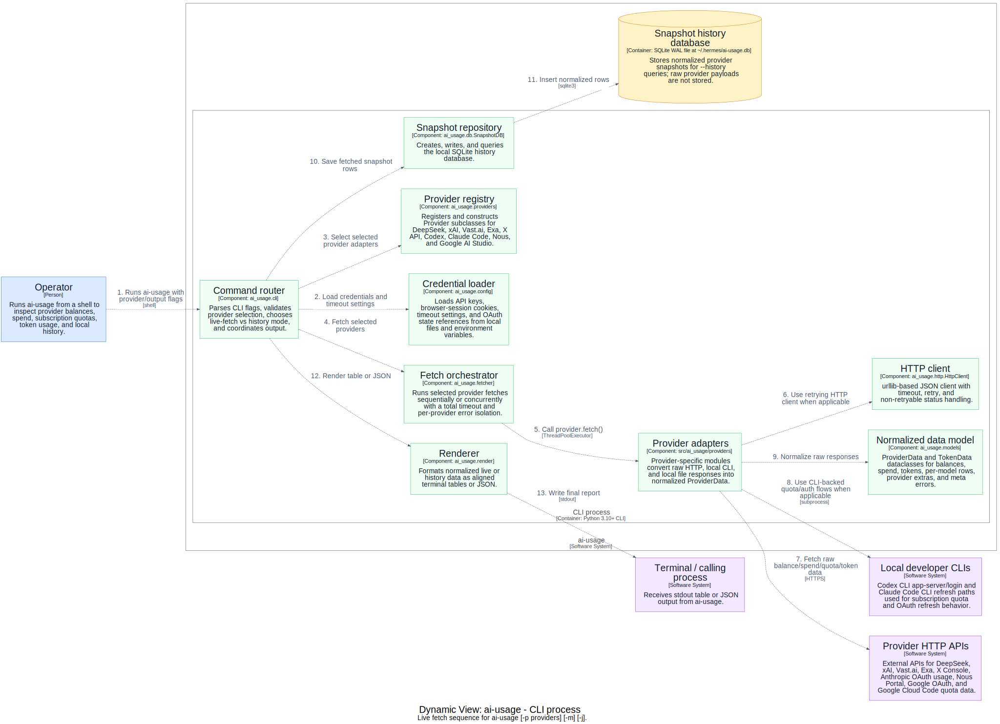

# Live Fetch Flow

> Generated Markdown wrapper for C4 view `LiveFetchFlow`. Canonical model: [`workspace.dsl`](../../workspace.dsl).

<!-- Generated from Structurizr exports; refresh from docs/architecture/workspace.dsl. -->

## Diagram

_Preferred Markdown display: Graphviz SVG. Mermaid source is retained below for text review._

```mermaid
graph LR
  linkStyle default fill:#ffffff

  subgraph diagram ["Dynamic View: ai-usage - CLI process"]
    style diagram fill:#ffffff,stroke:#ffffff

    1["<div style='font-weight: bold'>Operator</div><div style='font-size: 70%; margin-top: 0px'>[Person]</div><div style='font-size: 80%; margin-top:10px'>Runs ai-usage from a shell to<br />inspect provider balances,<br />spend, subscription quotas,<br />token usage, and local<br />history.</div>"]
    style 1 fill:#dbeafe,stroke:#2563eb,color:#111827

    15["<div style='font-weight: bold'>Local developer CLIs</div><div style='font-size: 70%; margin-top: 0px'>[Software System]</div><div style='font-size: 80%; margin-top:10px'>Codex CLI app-server/login<br />fallback and Claude Code CLI<br />refresh paths used for<br />subscription quota and OAuth<br />refresh behavior.</div>"]
    style 15 fill:#f3e8ff,stroke:#9333ea,color:#111827
    16["<div style='font-weight: bold'>Provider HTTP APIs</div><div style='font-size: 70%; margin-top: 0px'>[Software System]</div><div style='font-size: 80%; margin-top:10px'>External APIs for DeepSeek,<br />xAI, OpenRouter, Vast.ai,<br />Exa, X Console, Codex usage,<br />Anthropic OAuth usage, Nous<br />Portal, Google OAuth, and<br />Google Cloud Code<br />entitlement/quota data.</div>"]
    style 16 fill:#f3e8ff,stroke:#9333ea,color:#111827
    17["<div style='font-weight: bold'>Terminal / calling process</div><div style='font-size: 70%; margin-top: 0px'>[Software System]</div><div style='font-size: 80%; margin-top:10px'>Receives stdout table or JSON<br />output from ai-usage.</div>"]
    style 17 fill:#f3e8ff,stroke:#9333ea,color:#111827

    subgraph 2 ["ai-usage"]
      style 2 fill:#ffffff,stroke:#16a34a,color:#16a34a

      subgraph 3 ["CLI process"]
        style 3 fill:#ffffff,stroke:#0284c7,color:#0284c7

        10["<div style='font-weight: bold'>Normalized data model</div><div style='font-size: 70%; margin-top: 0px'>[Component: ai_usage.models]</div><div style='font-size: 80%; margin-top:10px'>ProviderData and TokenData<br />dataclasses for balances,<br />spend, tokens, per-model<br />rows, provider extras, and<br />meta errors.</div>"]
        style 10 fill:#f0fdf4,stroke:#22c55e,color:#111827
        11["<div style='font-weight: bold'>Snapshot repository</div><div style='font-size: 70%; margin-top: 0px'>[Component: ai_usage.db.SnapshotDB]</div><div style='font-size: 80%; margin-top:10px'>Creates, writes, and queries<br />the local SQLite history<br />database.</div>"]
        style 11 fill:#f0fdf4,stroke:#22c55e,color:#111827
        12["<div style='font-weight: bold'>Renderer</div><div style='font-size: 70%; margin-top: 0px'>[Component: ai_usage.render]</div><div style='font-size: 80%; margin-top:10px'>Formats normalized live or<br />history data as aligned<br />terminal tables or JSON.</div>"]
        style 12 fill:#f0fdf4,stroke:#22c55e,color:#111827
        4["<div style='font-weight: bold'>Command router</div><div style='font-size: 70%; margin-top: 0px'>[Component: ai_usage.cli]</div><div style='font-size: 80%; margin-top:10px'>Parses CLI flags, validates<br />provider selection, chooses<br />live-fetch vs history mode,<br />and coordinates output.</div>"]
        style 4 fill:#f0fdf4,stroke:#22c55e,color:#111827
        5["<div style='font-weight: bold'>Credential loader</div><div style='font-size: 70%; margin-top: 0px'>[Component: ai_usage.config]</div><div style='font-size: 80%; margin-top:10px'>Loads API keys,<br />browser-session cookies,<br />timeout settings, OAuth state<br />references, and Hermes Codex<br />credential-pool accounts from<br />local files and environment<br />variables.</div>"]
        style 5 fill:#f0fdf4,stroke:#22c55e,color:#111827
        6["<div style='font-weight: bold'>Provider registry</div><div style='font-size: 70%; margin-top: 0px'>[Component: ai_usage.providers]</div><div style='font-size: 80%; margin-top:10px'>Registers and constructs<br />Provider subclasses for<br />DeepSeek, xAI, OpenRouter,<br />Vast.ai, Exa, X API, Codex,<br />Claude Code, Nous, and Google<br />AI Studio.</div>"]
        style 6 fill:#f0fdf4,stroke:#22c55e,color:#111827
        7["<div style='font-weight: bold'>Fetch orchestrator</div><div style='font-size: 70%; margin-top: 0px'>[Component: ai_usage.fetcher]</div><div style='font-size: 80%; margin-top:10px'>Runs selected provider<br />fetches sequentially or<br />concurrently with a total<br />timeout and per-provider<br />error isolation.</div>"]
        style 7 fill:#f0fdf4,stroke:#22c55e,color:#111827
        8["<div style='font-weight: bold'>Provider adapters</div><div style='font-size: 70%; margin-top: 0px'>[Component: src/ai_usage/providers]</div><div style='font-size: 80%; margin-top:10px'>Provider-specific modules<br />convert raw HTTP, local CLI,<br />and local file responses into<br />normalized ProviderData.</div>"]
        style 8 fill:#f0fdf4,stroke:#22c55e,color:#111827
        9["<div style='font-weight: bold'>HTTP client</div><div style='font-size: 70%; margin-top: 0px'>[Component: ai_usage.http.HttpClient]</div><div style='font-size: 80%; margin-top:10px'>urllib-based JSON client with<br />timeout, retry, and<br />non-retryable status<br />handling.</div>"]
        style 9 fill:#f0fdf4,stroke:#22c55e,color:#111827
      end

      13[("<div style='font-weight: bold'>Snapshot history database</div><div style='font-size: 70%; margin-top: 0px'>[Container: SQLite WAL file at ~/.hermes/ai-usage.db]</div><div style='font-size: 80%; margin-top:10px'>Stores normalized provider<br />snapshots for --history<br />queries; raw provider<br />payloads are not stored.</div>")]
      style 13 fill:#fef3c7,stroke:#d97706,color:#111827
    end

    1["<div style='font-weight: bold'>Operator</div><div style='font-size: 70%; margin-top: 0px'>[Person]</div><div style='font-size: 80%; margin-top:10px'>Runs ai-usage from a shell to<br />inspect provider balances,<br />spend, subscription quotas,<br />token usage, and local<br />history.</div>"]
    style 1 fill:#dbeafe,stroke:#2563eb,color:#111827
    13[("<div style='font-weight: bold'>Snapshot history database</div><div style='font-size: 70%; margin-top: 0px'>[Container: SQLite WAL file at ~/.hermes/ai-usage.db]</div><div style='font-size: 80%; margin-top:10px'>Stores normalized provider<br />snapshots for --history<br />queries; raw provider<br />payloads are not stored.</div>")]
    style 13 fill:#fef3c7,stroke:#d97706,color:#111827
    15["<div style='font-weight: bold'>Local developer CLIs</div><div style='font-size: 70%; margin-top: 0px'>[Software System]</div><div style='font-size: 80%; margin-top:10px'>Codex CLI app-server/login<br />fallback and Claude Code CLI<br />refresh paths used for<br />subscription quota and OAuth<br />refresh behavior.</div>"]
    style 15 fill:#f3e8ff,stroke:#9333ea,color:#111827
    16["<div style='font-weight: bold'>Provider HTTP APIs</div><div style='font-size: 70%; margin-top: 0px'>[Software System]</div><div style='font-size: 80%; margin-top:10px'>External APIs for DeepSeek,<br />xAI, OpenRouter, Vast.ai,<br />Exa, X Console, Codex usage,<br />Anthropic OAuth usage, Nous<br />Portal, Google OAuth, and<br />Google Cloud Code<br />entitlement/quota data.</div>"]
    style 16 fill:#f3e8ff,stroke:#9333ea,color:#111827
    17["<div style='font-weight: bold'>Terminal / calling process</div><div style='font-size: 70%; margin-top: 0px'>[Software System]</div><div style='font-size: 80%; margin-top:10px'>Receives stdout table or JSON<br />output from ai-usage.</div>"]
    style 17 fill:#f3e8ff,stroke:#9333ea,color:#111827

    1-. "<div>1. Runs ai-usage with<br />provider/output flags</div><div style='font-size: 70%'>[shell]</div>" .->4
    4-. "<div>2. Load credentials and<br />timeout settings</div><div style='font-size: 70%'></div>" .->5
    4-. "<div>3. Select selected provider<br />adapters</div><div style='font-size: 70%'></div>" .->6
    4-. "<div>4. Fetch selected providers</div><div style='font-size: 70%'></div>" .->7
    7-. "<div>5. Call provider.fetch()</div><div style='font-size: 70%'>[ThreadPoolExecutor]</div>" .->8
    8-. "<div>6. Use retrying HTTP client<br />when applicable</div><div style='font-size: 70%'></div>" .->9
    8-. "<div>7. Fetch raw<br />balance/spend/quota/token<br />data</div><div style='font-size: 70%'>[HTTPS]</div>" .->16
    8-. "<div>8. Use CLI-backed quota/auth<br />fallback flows when<br />applicable</div><div style='font-size: 70%'>[subprocess]</div>" .->15
    8-. "<div>9. Normalize raw responses</div><div style='font-size: 70%'></div>" .->10
    4-. "<div>10. Save fetched snapshot<br />rows</div><div style='font-size: 70%'></div>" .->11
    11-. "<div>11. Insert normalized rows</div><div style='font-size: 70%'>[sqlite3]</div>" .->13
    4-. "<div>12. Render table or JSON</div><div style='font-size: 70%'></div>" .->12
    12-. "<div>13. Write final report</div><div style='font-size: 70%'>[stdout]</div>" .->17

  end
```

Mermaid source

## Derived artifacts

| Artifact | Link |
|---|---|
| Mermaid source | [`structurizr-LiveFetchFlow.mmd`](../structurizr-LiveFetchFlow.mmd) |
| Mermaid SVG | [`structurizr-LiveFetchFlow.svg`](../structurizr-LiveFetchFlow.svg) |
| Mermaid PNG | [`structurizr-LiveFetchFlow.png`](../structurizr-LiveFetchFlow.png) |
| DOT source | [`structurizr-LiveFetchFlow.dot`](../dot/structurizr-LiveFetchFlow.dot) |
| Graphviz SVG | [`structurizr-LiveFetchFlow.svg`](../dot-rendered/structurizr-LiveFetchFlow.svg) |
| Graphviz PNG | [`structurizr-LiveFetchFlow.png`](../dot-rendered/structurizr-LiveFetchFlow.png) |
