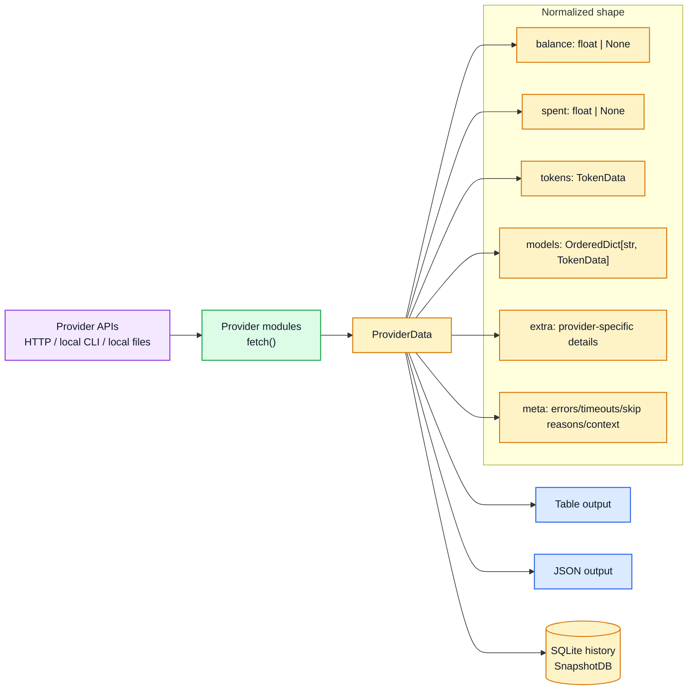
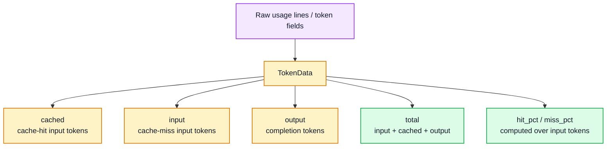
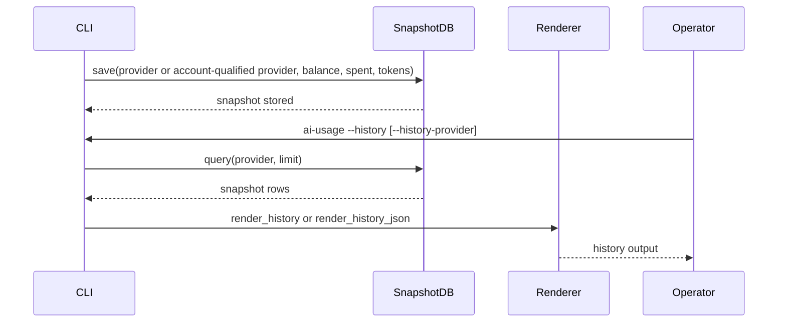

# ai-usage Data Architecture

| Field | Value |
|---|---|
| Status | Active local workstation utility |
| Source of truth | Markdown and Mermaid in this file |
| Normalized model | `ProviderData` and `TokenData` in `src/ai_usage/models.py` |
| Legacy rendered companion | `data-architecture.html` |

## Overview

Provider modules fetch provider-specific balance, billing, quota, or usage payloads and convert them into the shared `ProviderData` shape used by rendering and snapshot history.

## Provider-to-field mapping

| Provider | Raw source | Normalized fields |
|---|---|---|
| DeepSeek | `/user/balance`; `/api/v0/usage/amount` | `balance`, calculated `spent`, aggregate/model `TokenData` |
| xAI | Management billing balance and invoice preview | `balance`, `spent`, aggregate/model `TokenData` |
| OpenRouter | Credits and current-key APIs | `balance` as remaining credits, `spent` as current key month-to-date usage; tokens are not exposed |
| Vast.ai | Current user credit and charges APIs | `balance`, `spent`; tokens are not applicable |
| Exa | Dashboard balance and admin usage APIs | `balance`, `spent`; tokens are not applicable; disabled or unconfigured runs set `meta.skip_reason` so the row renders `disabled` or `auth missing` instead of bare blanks |
| X API | Console credits and usage APIs | `balance`, calculated `spent`; tokens are not applicable |
| Codex | Preferred: Codex usage API per Hermes `credential_pool.openai-codex` entry; fallback: Codex app-server rate-limit JSON-RPC | `extra.accounts` maps Hermes account labels to quota rows; dollar/token fields are not applicable; per-account failures stay visible without hiding other accounts; fallback app-server auth failures run one interactive `codex login` retry on TTY, otherwise set `meta.auth_error` and stay visible as an `auth failed` quota row |
| Claude Code | OAuth usage endpoint, local usage files, and Claude CLI refresh | `extra` quota rows and provider-specific model details; `meta.token_refreshed`, `meta.oauth_retry_status`, and `meta.refresh_error` describe refresh behavior when needed |
| Nous | Portal OAuth account/subscription and token endpoints | `balance`/credits plus subscription `extra`; missing auth sets `meta.skip_reason`, and OAuth refresh sets `meta.token_refreshed`/`meta.oauth_retry_status` when automatic retry is needed |
| Google AI Studio | Cloud Code `loadCodeAssist` entitlement endpoint plus available-models/quota endpoint | `extra.plan_type`/`plan_label`/`plan_source` from `paidTier` or `currentTier`; `extra.models` model quota rows from `fetchAvailableModels`; cached token refreshes before expiry and once after auth/rate-limit endpoint failures |

## Token model

## History flow

Codex multi-account live fetches save history rows under provider keys such as `codex:primary` and `codex:partner`; `--history-provider codex` queries both the legacy `codex` key and account-qualified `codex:*` rows.

## Documentation rules

- Keep this Markdown document synchronized with provider endpoint and normalized-field changes.
- Treat `architecture.html` and `data-architecture.html` as legacy rendered references unless they are explicitly regenerated from canonical Markdown.
- Never document real credential values; use environment-variable names and `[REDACTED]` placeholders only.
